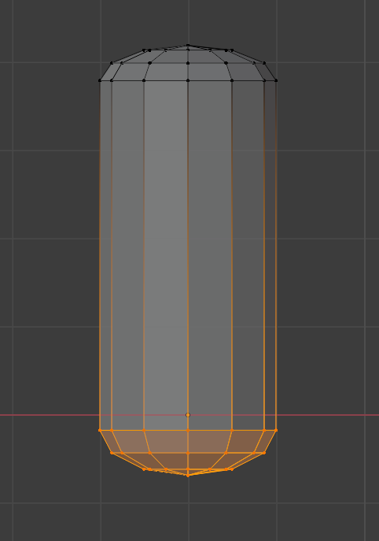

Blender donut tutorial notebook - level 2
=========================================

This carries on my notebook for the [Blender donut tutorial](https://www.youtube.com/watch?v=TPrnSACiTJ4&list=PLjEaoINr3zgEq0u2MzVgAaHEBt--xLB6U). There first part of the notebook is [here](README.md) and covers level 1. This part covers level 2.

Level 2, Part 1 - particles
---------------------------

Return to the _Layout_ workspace if you're still in _Compositing_ and to the simple _Solid_ _Viewport Shading_ rather than _Rendered_.

### Organize your Outliner

The _Scene Collection_ (upper-right corner) is actually part of the _Editor Type_ called _Outliner_. We already created the _Archive_ collection there that we can exclude from the view layer. So let's do the same for everything else and clean up the _Outliner_ to make everything more manageable:

* Select both donut and icing, add press `m` (for move) and add a _New Collection_ that's also called "Donut" - this seems a bit stupid, i.e. a collection with a single thing in it, but we can exclude the collection from the view layer (via the checkbox beside the eye icon) as well as just hiding it (the eye icon). An excluded item is excluded from any render whereas a hidden item is just hidden in the viewport.
* Select the plane and add it to a new collection called "Environment".
* Rename the original _Collection_ (which should now just contain the _Camera_ and _Light_) to "Camera and light"

**Important:** I kept on selecting just the donut body in the viewport and then pressing `m` - this resulted in the real icing being left behind in the original collection with the donut ending up in the new collection with just some kind of ghost-like link to its icing child. See the _Icing_ under _Collection_ here and the greyed out _Icing_ child of _Donut_:

Even if you select the donut parent in the _Scene Collection_, you still also have to control-click the upside down triangle, corresponding to the icing object, before pressing `m`.

### Create the first sprinkle

First exclude all collections (Andrew says "hide" but he means exclude), i.e. untick the checkboxes for the "Camera and light", "Donut" and "Environment" collections.

First, `shift-A` and under _Mesh_, add a _UV Sphere_ (what U and V mean is a little complicated, see the Wikipedia [_UV mapping_](UV mapping) page and for the difference, again quite complicated, between _UV Shere_ and _Icosphere_, see this StackExchange [question](https://blender.stackexchange.com/q/72)). Then before you click away, go to the _Add UV Sphere_ dialog (lower-right) and change the _Radius_ from 1m to 1mm and adjust down _Segments_ to 12 and _Rings_ to 6 (otherwise your render times will be terrible once you've got hundreds of sprinkles on your icing).

**Note:** clipping came up before very early on, here when I zoomed in on the sphere it disappeared as I got close. This can be resolved by pressing `n` to pop out the side menu, selecting the _View_ tab and changing the _Clip Start_ to 1mm. Make sure you're not in camera view as it has its own clipping settings and will still clip even if you adjust _Clip Start_.

Unexclude the "Donut" collection, press `Numpad-0` (front view), select the sphere, then `g` and `x` and drag it off to the left of the donut:

`tab` into _Edit Mode and toggle on x-ray - `alt-Z` - and select the top half of the sphere. Then `g` and try moving it:

**Important:* make sure proportional is off or you'll just end up dragging the whole sphere (because the proportional area of influence extends over the whole tiny sphere).

So simple `g` isn't quite what we want, cancel and use `e` (for extrude) instead:

Then with the top of the sphere still selected, press `s` and `z` and drag the mouse up and down to flatten the end a bit. Then select the bottom half and do the same:

`tab` back to _Object Mode_, toggle off x-ray - `alt-Z`, right-click on the sprinkle and select _Shade Smooth_.

Note: oddly, if you haven't got the sprinkle currently selected, you can right click on it and select _Shade Smooth_ but it does nothing.

### Particle instances

Particle instances is where you reference one object and duplicate it over the surface of another object.

Select the icing, go to _Particle Properties_ and for whatever reason there's no _New_, instead click the plus icon and then press _Play Animation_ (as for the monkey head fire animation) and you get a very strange particle effect. So switch from the default _Emitter_ particle type (animated) to _Hair_ type (static) for an initially even weirder static effect:

Then expand the _Render_ section of the _Particle Properties_ and switch _Render As_ from a _Path_ (i.e. essentially a hair) to an _Object_, then click the eye dropper in the _Instance Object_ field and select the sprinkle:

Then adjust the _Scale_ value (under where you just set _Render As_) to e.g. 1.6 and set _Scale Randomness_ to a tiny value e.g. 0.1 or just leave it alone.

Andrew notes that you'd use particles like this to scatter rocks over a scene but there you'd crank up _Scale Randomness_ to create far more variation in rock sizes.

As you can see the sprinkles are all facing the same direction, so tick _Advanced_ and tick, expand the _Rotation_ section and change _Orientation Axis_ from _Velocity / Hair_ to _Normal_. Now, try adjusting _Randomize - interesting but this clearly isn't what we want - then trying adjusting _Randomize Phase_.

Set _Randomize Phase_ to maximum and then set _Randomize_ to a tiny value, e.g. 0.15, as you don't want all the sprinkles lying perfectly on the surface, you want some to turn a little randomly relative to the surface as they would when sinking into the icing.

Note: Andrew notes that it's a bit odd that the random settings are under _Advanced_ as he always uses them.

### Weight painting

Hide the donut (but not the icing) by unselecting its eye icon and you'll see there are sprinkles on the underside of the icing (and also on the the sides and dribbles where real sprinkles wouldn't usually stick):

Unhide the donut, go to the dropdown where you see _Object Mode_ and change it to _Weight Paint_. Unlike _Edit Mode_, you can't just `tab` to this mode, but you can press `ctrl-tab` to bring up a pie menu and select _Weight Paint_.

Just click and paint on the blue, blue means zero, i.e. no sprinkles later , and red means one, i.e. maximum:

Redrawing the particles while painting can be quite compute intensive and slow things down, so you can turn them off temporarily while painting by unselecting the little monitor icon (beside the camera and the plus in the _Particle Properties_).

As with sculpting, you can adjust the brush radius with `f` - Andrew uses a radius of about 270px. Draw a big fat circle on the top of the icing, then adjust the radius down, e.g. to 150px, and flip the _Weight_ value between 1 (to draw in red) and 0 to draw in blue to get exactly the coverage you want:

Re-enable the sprinkles (monitor icon) and switch back to _Object Mode_ - interestingly, `tab` would switch to _Edit Mode_ but then `tab` again would switch back to _Weight Mode_, i.e. `tab` toggles between _Edit Mode_ and the previously selected mode. So use `ctrl-tab` instead.

Nothing has changed, to get the particles to use the weight painting, go to _Particle Properties, then go right down and expand _Vertex Groups_ and set _Density_ to _Group_:

I had to go back and adjust the weight painting until I was happy there weren't too many sprinkles close to the edges of the icing where it's steepest.

Note: you can just go back to _Weight Paint_ mode and work with the weight painting but if you've got the icing selected, you can also go to _Object Data Properties_ and you'll see it under _Vertex Groups_ with the default name _Group_. Go into _Weight Paint_ mode and click minus to remove this vertex group and see what happens (then press `ctrl-Z` to undo this).

If you feel you got too many sprinkles, go back to _Particle Properties_ and in the _Emission_ section, adjust the _Number_ value down to e.g. 700.

If you do a render now, things will look very strange until you un-exclude the collections for camera, light and environment (and make sure you've got the camera looking at what you want).

Level 2, Part 2 - random materials
----------------------------------

...