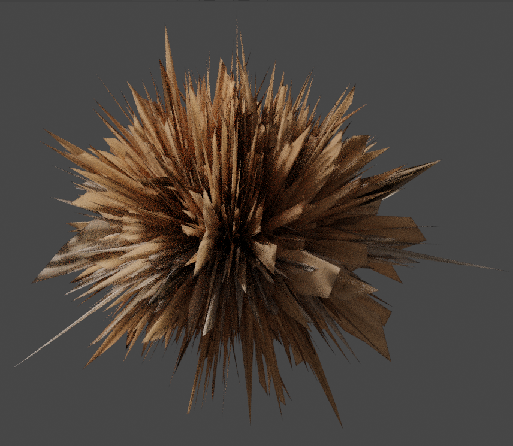
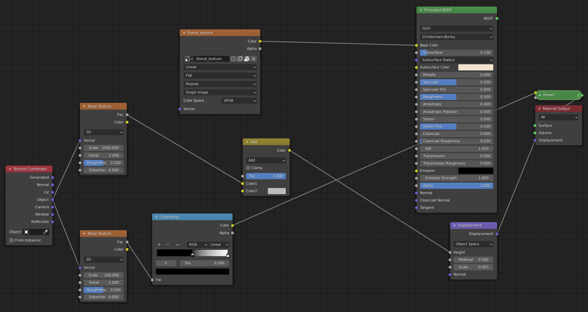
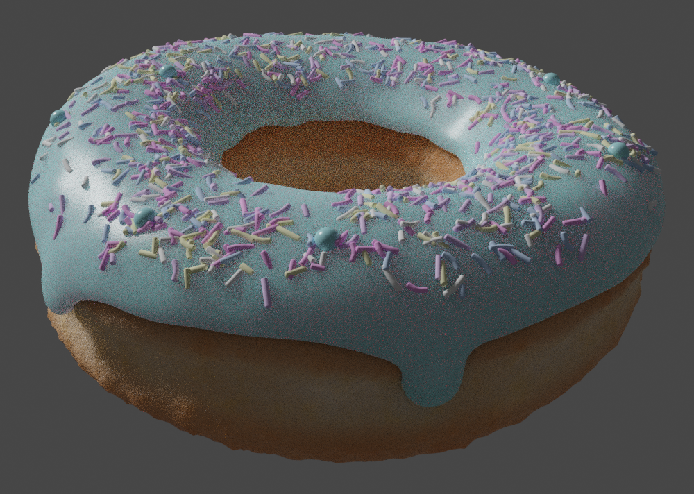
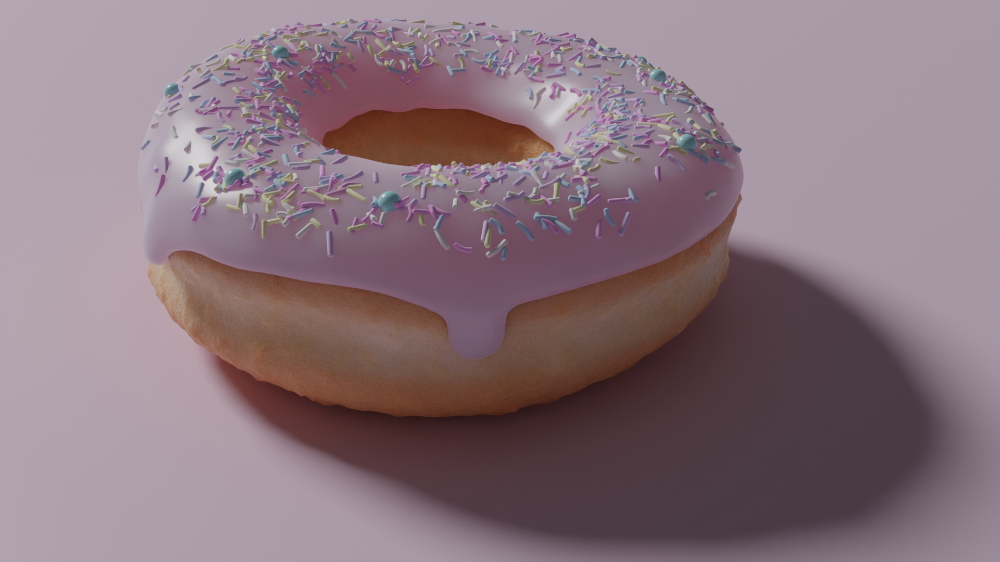

Blender donut tutorial notebook - level 2
=========================================

This carries on my notebook for the [Blender donut tutorial](https://www.youtube.com/watch?v=TPrnSACiTJ4&list=PLjEaoINr3zgEq0u2MzVgAaHEBt--xLB6U). There first part of the notebook is [here](README.md) and covers level 1. This part covers level 2.

Level 2, Part 1 - particles
---------------------------

Return to the _Layout_ workspace if you're still in _Compositing_ and to the simple _Solid_ viewport shading rather than _Rendered_.

### Organize your Outliner

The _Scene Collection_ (upper-right corner) is actually part of the _Editor Type_ called _Outliner_. We already created the "Archive" collection there so that we could exclude it from the view layer. So let's do the same for everything else and clean up the _Outliner_ to make everything more manageable:

* Select both donut and icing, add press `m` (for move) and add a _New Collection_ that's also called "Donut" - this seems a bit stupid, i.e. a collection with a single thing in it, but we can exclude the collection from the view layer (via the checkbox beside the eye icon) as well as just hiding it (the eye icon). An excluded item is excluded from any render whereas a hidden item is just hidden in the viewport.
* Select the plane and add it to a new collection called "Environment".
* Rename the original _Collection_ (which should now just contain the _Camera_ and _Light_) to "Camera and light"

**Important:** I kept on selecting just the donut body in the viewport and then pressing `m` - this resulted in the real icing being left behind in the original collection with the donut ending up in the new collection with just some kind of ghost-like link to its icing child. See the _Icing_ under _Collection_ here and the greyed out _Icing_ child of _Donut_:

Even if you select the donut parent in the _Scene Collection_, you still also have to control-click the upside down triangle, corresponding to the icing object, before pressing `m`.

### Create the first sprinkle

First exclude all collections (Andrew says "hide" but he means exclude), i.e. untick the checkboxes for the "Camera and light", "Donut" and "Environment" collections.

First, `shift-A` and under _Mesh_, add a _UV Sphere_ (what U and V mean is a little complicated, see the Wikipedia [_UV mapping_](https://en.wikipedia.org/wiki/UV_mapping) page and for the difference, again quite complicated, between _UV Sphere_ and _Icosphere_, see this StackExchange [question](https://blender.stackexchange.com/q/72)). Then before you click away, go to the _Add UV Sphere_ operator panel (lower-right) and change the _Radius_ from 1m to 1mm and adjust down _Segments_ to 12 and _Rings_ to 6 (otherwise your render times will be terrible once you've got hundreds of sprinkles on your icing).

**Note:** clipping came up before very early on, here when I zoomed in on the sphere it disappeared as I got close. This can be resolved by pressing `n` to pop out the side menu, selecting the _View_ tab and changing the _Clip Start_ to 1mm. Make sure you're not in camera view as it has its own clipping settings and will still clip even if you adjust _Clip Start_.

Unexclude the "Donut" collection, press `Numpad-0` (front view), select the sphere, then `g` and `x` and drag it off to the left of the donut:

`tab` into _Edit Mode_ and toggle on x-ray - `alt-Z` - and select the top half of the sphere. Then `g` and try moving it:

**Important:** make sure proportional is off or you'll just end up dragging the whole sphere (because the proportional area of influence extends over the whole tiny sphere).

So, simple `g` isn't quite what we want, cancel and use `e` (for extrude) instead:

Then with the top of the sphere still selected, press `s` and `z` and drag the mouse up and down to flatten the end a bit. Then select the bottom half and do the same:

`tab` back to _Object Mode_, toggle off x-ray - `alt-Z`, right-click on the sprinkle and select _Shade Smooth_.

Note: oddly, if you haven't got the sprinkle currently selected, you can right-click on it and select _Shade Smooth_ but it does nothing.

### Particle instances

_Particle instances_ is where you reference one object and duplicate it over the surface of another object.

Select the icing, go to _Particle Properties_ and, for whatever reason, there's no _New_ so instead, click the plus icon and then press _Play Animation_ (as for the monkey head fire animation) and you get a very strange particle effect. So switch from the default _Emitter_ particle type (animated) to _Hair_ type (static) for an initially even weirder static effect:

Then expand the _Render_ section of the _Particle Properties_ and switch _Render As_ from a _Path_ (i.e. essentially a hair) to an _Object_, then click the eye dropper in the _Instance Object_ field and select the sprinkle:

Then adjust the _Scale_ value (under where you just set _Render As_) to e.g. 1.6 and set _Scale Randomness_ to a tiny value e.g. 0.1 or just leave it alone.

Andrew notes that you'd use particles like this to scatter rocks over a scene but there you'd crank up _Scale Randomness_ to create far more variation in rock sizes.

As you can see the sprinkles are all facing the same direction, so tick _Advanced_ and expand the _Rotation_ section and change _Orientation Axis_ from _Velocity / Hair_ to _Normal_. Now, try adjusting _Randomize_ - interesting but this clearly isn't what we want - then trying adjusting _Randomize Phase_.

Set _Randomize Phase_ to maximum and then set _Randomize_ to a tiny value, e.g. 0.15, as you don't want all the sprinkles lying perfectly on the surface, you want some to turn a little randomly relative to the surface as they would when sinking into the icing.

Try adjusting _Randomize_ up and down - you'll notice something odd, it's looks as if the center of gravity of each sprinkle is one of its ends rather that its middle - this will be addressed in the next lesson.

Aside: Andrew notes that it's a bit odd that the random settings are under _Advanced_ as he always uses them.

### Weight painting

Hide the donut (but not the icing) by unselecting its eye icon and you'll see there are sprinkles on the underside of the icing (and also on the sides and dribbles where real sprinkles wouldn't usually stick):

Unhide the donut, go to the dropdown where you see _Object Mode_ and change it to _Weight Paint_. Unlike _Edit Mode_, you can't just `tab` to this mode, but you can press `ctrl-tab` to bring up a pie menu and select _Weight Paint_.

Just click and paint on the blue, blue means zero, i.e. no sprinkles later , and red means one, i.e. maximum:

Redrawing the particles while painting can be quite compute intensive and slow things down, so you can turn them off temporarily while painting by unselecting the little monitor icon (beside the camera and the plus in the _Particle Properties_).

As with sculpting, you can adjust the brush radius with `f` - Andrew uses a radius of about 270px. Draw a big fat circle on the top of the icing, then adjust the radius down, e.g. to 150px, and flip the _Weight_ value between 1 (to draw in red) and 0 (to draw in blue) to get exactly the coverage you want:

Re-enable the sprinkles (monitor icon) and switch back to _Object Mode_ - interestingly, `tab` would switch to _Edit Mode_ but then `tab` again would switch back to _Weight Mode_, i.e. `tab` toggles between _Edit Mode_ and the previously selected mode. So use `ctrl-tab` instead.

Nothing has changed, to get the particles to use the weight painting, go to _Particle Properties_, then go right down and expand _Vertex Groups_ and set _Density_ to _Group_:

I had to go back and adjust the weight painting until I was happy there weren't too many sprinkles close to the edges of the icing where it's steepest.

Note: you can just go back to _Weight Paint_ mode and work with the weight painting but if you've got the icing selected, you can also go to _Object Data Properties_ and you'll see it under _Vertex Groups_ with the default name _Group_. Go into _Weight Paint_ mode and click minus to remove this vertex group and see what happens (then press `ctrl-Z` to undo this).

If you feel you got too many sprinkles, go back to _Particle Properties_ and in the _Emission_ section, adjust the _Number_ value down to e.g. 700.

**Update:** you can see he settles on 800 much later on.

If you do a render now, things will look very strange until you un-exclude the collections for camera, light and environment (and make sure you've got the camera looking at what you want).

Level 2, Part 2 - random materials
----------------------------------

Make sure you're in _Object Mode_ and switch from _Solid_ viewport shading to _Rendered_ (with `z` pie menu). Does your donut look very weird?:

To correct this, just un-exclude the camera and light collection (but leave the environment collection excluded).

To change the color for the currently tic-tac-like sprinkles, select the original single sprinkle (off to the side of the donut), go to _Material Properties_, click _New_ and set _Base Color_ to HSV 0.6, 0.7 and 0.9, you'll end up with all blue sprinkles:

### Random set of colors

Now switch to _Solid_ viewport shading (`z` and `6`) and click the _Shading_ button in the main menu bar. The resulting workspace looks quite strange:

In particular, the background is quite odd - you see a very blurry version of the outdoor scene that you can see in the mirrored sphere. And the donut is almost invisible - but you can see the 3D cursor that marks its center. Just zoom-in on the donut to bring it into view.

**Important:** we're now in the _Shading_ workspace but we've already been working with viewport shading, which is something different, i.e. the _Solid_, _Rendered_ etc. discs that you see in the upper-right of the viewport. Look at which of the viewport shading discs is currently selected - it's _Material Preview_ - when we switched to the _Shading_ workspace, it automatically switched from _Rendered_ to this. To the right of the viewport shading discs is a drop-down arrow - it reveals options specific to the currently selected viewport shading mode. Try it and you'll see these options for _Material Preview_:

The [documentation](https://docs.blender.org/manual/en/latest/editors/3dview/display/shading.html) is a little confusing - the mirrored sphere is what's referred to in the documentation as the _HDRI Environment_, i.e. the "environment map used to light the scene". It, _Rotation_, _Strength_, _World Opacity_ and _Blur_ only come into play if _Scene World_ is unticked (as it is by default in Blender 2.92). Try clicking on the sphere and choosing a different environment map and try reducing _Blur_ to zero to the environment far more clearly.

In the video it _looks_ as if there's no environment showing. You can get a similar look to this by ticking both _Scene Lights_ and _Scene World_ but then the mirrored sphere disappears from the viewport. Alternatively, you can set _World Opacity_ to 0 to get something that looks similar to Andrew's setup. However, it may simply be that he's zoomed in such that we no longer see much structure in the background environment map. I left all viewport shading options as they were, i.e. unchanged.

Note: what Andrew refers to as "LookDev mode" has been renamed to _Material Preview_ (see [here](https://developer.blender.org/T68312) - there, they also note that the intention was to remove _Scene Lights_ and _Scene World_ but other people argued to keep them).

Select the original sprinkle so that its nodes show up in the _Shader Editor_, notice how the contents of the _Principled BSDF_ node are identical to those in the _Shading_ section of the _Material Properties_:

The node view is another view on these same properties where you can use and manipulate them in a far more advanced way. If you adjust values in the node view, you'll see those changes reflected in the _Material Properties_ and vice-versa.

Aside: what does _BSDF_ stand for? See [here](https://en.wikipedia.org/wiki/Bidirectional_scattering_distribution_function) on Wikipedia and [here](https://blender.stackexchange.com/a/786) on the Blender StackExchange for an answer.

We want to add a node that will set the _Base Color_ of the _Principled BSDF_ node. Press `shift-A`, go to _Input_ and select _Object Info_. Then drag its _Random_ output to the _Base Color_ input and you end up with sprinkles where the colors vary through the greyscale from white to black:

Everytime the sprinkle object is replicated, duplicated or referenced, _Random_ is used to provide a new value for _Base Color_. It's just producing a value from 0 to 1 on a gradient that currently goes from black, i.e. 0, to white, i.e. 1. To get a more interesting gradient, press `shift-A`, go to _Converter_ and select _ColorRamp_. Drag the resulting node on top of the line between _Random_ and _Base Color_ and _Random_ will be automatically rewired to the _Fac_ input on the new node and its _Color_ output will be wired through to _Base Color_:

Click the black area in the _ColorRamp_ node, change it to e.g. bright red and see what happens (drag the _V_ color value up to 1.0 first or everything stays black).

Now, to add more colors into the color ramp - just click the plus button three times to introduce three new color stops and then click the drop-down arrow to the right of the minus button and select _Distribute Stops Evenly_. Click each of the stops in turn, to select it, and then click the little block, that makes up its body, and change its color. Andrew used the following colors for the first four stops and left the right-most one as white:

* Blue - HSV 0.6, 0.45 and 1.
* Purple - HSV 0.76, 0.4 and 1.
* Hot pink - HSV 0.85, 0.54 and 1.
* Yellow - HSV 0.16, 0.4 and 1

Selecting the stops is a little odd - they didn't always select when I clicked them - when you've selected one successfully, you'll see a dotted line appear above it.

The sprinkles now have these colors - and every color in-between them. To limit our color ramp to just the colors of the stops, change the node's _Interpolation_ value from _Linear_ to _Constant_. The proportion of the color ramp that has a given color determines how many sprinkles have that color - as white is hard up against the right edge, no sprinkles have a white color, so go to the drop-down arrow to the left of the minus again and select _Distribute Stops from Left_:

_If_ you want way more hot-pink sprinkles just drag things such that hot-pink takes up way more of the color ramp.

As a last step adjust the _Roughness_ value (either in the _Principled BSDF_ node or in _Material Properties_) to 0.8 for more chalky-style sprinkles.

### Varying sprinkle size

Switch back to _Layout_ workspace and _Solid_ viewport shading and select the icing. If you go to _Particle Properties_ and then, in the _Render_ section, adjust the _Scale Randomness_ value (currently 0.1) up and down then we vary both their length and width, which isn't what we want, so leave it as it is.

So find the original sprinkle, select it, right click it and select _Duplicate Objects_ (or just press `shift-D`) and drag it to the right (click and release MMB to make this easier, assuming you used NumPad `.` and `1` to get the sprinkle nicely focused in a front on view).

With the duplicate selected, `tab` into _Edit Mode_, toggle on x-ray mode (`alt-Z`), select its top end, then `g` and `z` and then pull the top up until the sprinkle is twice as long:

`tab` out of edit mode and select each of the sprinkles in turn and, with `F2`, give them the names "Sprinkle_short" and "Sprinkle_long". Then select both, press `m` and move them to a _New Collection_ called "Sprinkles".

Aside: I kept mistakenly pressing `shift-M` (rather than just `m`) and getting confused as to why I had a collection containing the sprinkles but they could still also be seen outside the collection in the _Outliner_. `shift-M` links the objects into a collection rather than moving them.

Then select the icing, go to _Particle Properties_ and, in the _Render_ section, change the _Render As_ value from _Object_ to _Collection_. Then in the _Collection_ section that's now appeared below, click on the _Instance Collection_ field and choose "Sprinkles".

Switch to _Material Preview_ viewport shading (`z` and `2`) for a less-processing expensive view of the result than the _Render_ mode:

### More variety

Select the original sprinkle and create a medium length one (in just the same way as the long one).

Select the long sprinkle, duplicate it, `tab` to _Edit Mode_ and select _Loop Cut_ in the toolbar along the left edge of the viewport (or just press `ctrl-R`):

Move the mouse around the selected object and you can see the loop-cut outline move around showing different possible cuts. Move the mouse such that you get a loop around the middle of the sprinkle, then click, then move the mouse again to select where along the length of the sprinkle you want the cut - and now you've got a new set of vertices that allow you to add more detail to the object.

Alternatively, and what we'll do here, press `ctrl-R`, then move the mouse until the loop is around the middle again but now turn the scroll wheel to get additional loops - we just want two - then click and then right-click (the right-click just avoids the phase where you can place the cuts and just places them in their default positions).

Then with the middle section selected, press `g` and `x` and deform the sprinkle a bit:

Then select the ends and use `r` to rotate them nicely relative to the now bent body:

For an alternative way of doing much the same thing, duplicate the small sprinkle, `tab` to _Edit Mode_ and:

* Select the top of the sprinkle (with x-ray - `alt-Z`).
* Press `e` (to extrude) and pull up a little, click to release (but stay selected).
* Press `g` and pull to the side a bit, click to release.
* Press `r` (to rotate) until the middle section is a nice [isoceles trapezoid](https://mathworld.wolfram.com/IsoscelesTrapezoid.html) (see image below) - initially I was under-rotating at this point and getting a very odd shaped sprinkle.
* Repeat the `e`, `g` and `r` steps to pull out another segment.

In the end you should have a collection like this (the left-most one being the completed extruded sprinkle):

If you look at the donut now, things are looking good but we see the issue, commented on previously, that the center of gravity of each sprinkle seems to be one of the ends rather than the center - some sprinkles are sticking up out of the icing at a dramatic angle. This is due to the origin point - which you can see when you select an object:

It's the little orange dot at the base of the selected sprinkles above. This origin point is the point at which the sprinkle attaches itself to the surface of the icing.

So with all the sprinkles selected, right-click, go to _Set Origin_ and select _Origin to Geometry_ and this centers the origin points:

Now, we've got all kinds of sprinkle shapes nicely laid out on our donut:

### Intersection

If you look closely at the donut, you'll see that you've got particles, i.e. sprinkles, that are intersecting other particles.

Andrew explains that the particle system in Blender is a little old and there's just no good way to fix this. It should be able to examine the sprinkle mesh shapes and detect intersections but it can't. Andrew says that in Blender 2.83 or 2.84 the intention is to introduce particle nodes that can address this. However, I'm using Blender 2.92 and I've looked for information on developments on avoiding intersections - there are approaches but none of them are particularly simple (there's certainly no _Disable Intersections_ checkbox).

Andrew's suggestion, if you're particularly unhappy with some really odd clump of sprinkles or odd intersections, is to select the icing, go to the _Emission_ section of _Particle Properties_ and just keep on incrementing the _Seed_ value to force it to generate a new pattern of sprinkles and pick the one you're most happy with (temporarily turning off _Show Overlays_ makes it easier to see the sprinkles without the selection outlines):

In particular, you may want to come back to _Seed_ when you're unhappy with something that shows up particularly clearly in a final high-quality render.

Aside: for a quick explanation of what a random seed is, see the [random seed](https://en.wikipedia.org/wiki/Random_seed) Wikipedia article or [here](https://stats.stackexchange.com/a/354379/322395) on the stats StackExchange.

### Adding balls as an additional sprinkle type

As noted before the 3D cursor determines where new objects are added, so press `shift-RMB` and move it out to the left of the sprinkles (you can return it, later, to its default location, with `shift-C`).

Then `shift-A` and add a new _UV Sphere_ (under _Mesh_) - it'll start as absolutely massive relative to the existing sprinkles, so in the _Add UV Sphere_ operator panel change _Segments_ to 16, _Rings_ to 8 and _Radius_ to 4mm.

Select it, right-click and select _Shade Smooth_, then `g` and move it to where you want it relative to the other sprinkles.

Note: the existing sprinkles all share a common material, i.e. it's not simply duplicated with them. If you e.g. adjust the roughness for one then it affects all of them. The material isn't an attribute of an object - the material is a thing in its own right. When duplicating objects, you don't duplicate the material you simply duplicate a reference to it.

**Update:** if you have an object selected, are in _Edit Mode_ and then add an additional shape, it doesn't become an object in its own right - it becomes part of the existing object and, even though you can move the new shape around completely independently, it shares the material and other attributes of the existing object - i.e. it just becomes a disconnected part of the existing object's mesh.

In any case, the sphere doesn't share the material that the existing sprinkles all share - which is good as we want to give the balls one fixed color. With the sphere selected, go to _Material Properties_, click _New_ and give it a _Base Color_ with e.g. HSV 0.52, 0.55 and 0.9 for an aqua color. And give it a _Roughness_ value of about 0.24 to make it quite shiny.

Note that you can expand the preview section to get a quick higher-quality preview on how it'll look:

Select the sphere, press `m` and instead of creating a new collection, just select the "Sprinkles" collection from the list shown. If you'd had the "Sprinkles" collection selected in the _Outliner_ when you added the sphere then it would have ended up there automatically.

The donut looks pretty horrific now, we've got as many balls as we do of the other sprinkle variants:

To fix this, select the icing, go to the _Collection_ section in the _Particle Properties_ and tick and expand the _Use Count_ item. By default, each item has a count that gives it equal weight:

It's probably a good time to clean up the sprinkle names if some of them still have odd auto-generated names from when they were created.

You can now, as well as controlling the number of balls, give medium sprinkles more weight than long or show ones. So e.g. change the counts for short and long sprinkles to 30 and medium ones to 60 and leave the spheres at 1.

Note: as seen in the video leaving the sphere's count at 1 gives slightly too few spheres while 2 gives slightly too many. I thought this could be fixed by increasing all the counts by a factor of 10 which would allow me to then set the sphere's count to 15, i.e. like setting it to 1.5 before applying the factor of 10. But this didn't work out at all as I expected - in fact things get very strange. This is due to the size of these counts relative to the total number of particles being used (e.g. 800) - it starts with the first item on the list and scatters the given count of those objects on the icing, goes on to the second list item, does the same and so on until its reached the desired number of particles (looping through the list again if necessary). So if you set the counts very high, you end up actually only using the first one or two objects in the list. For a really weird outcome set the cylinder like sprinkles to values of 60 or 30 (as suggested above) and set the sphere count to 400:

What's with the weird distribution of spheres that misses out a segment of the icing altogether?

**Update:** I asked about this [here](https://blender.stackexchange.com/q/223318/124535) on the Blender StackExchange and it turns out that this is an unusual situation where Andrew has missed out something important - the _Pick Random_ option. It turns out that the algorithm, that chooses particle objects, goes through the list repeatedly, laying down objects _in clumps_ according to the count assigned to each object, until it hits the total number of required particles. Things only look random when the counts are small enough that the algorithm has to go through the list many times, laying down clumps of one object on top of another such that eventually everything looks reasonably mixed up. But try increasing the counts such that they become large relative to the total number of particles and you notice the issue. You need to tick _Pick Random_ to resolve this issue. Once you've done this you can do what I wanted, i.e. assign the cylindrical sprinkles values of 300 or 600 (rather than 30 or 60) and then assign the balls a value between 10 and 20 (giving you more control than you have when forced to choose either 1 or 2). I'd prefer to be able to assign objects a probability of being chosen, rather than a count, and I've asked about that [here](https://blender.stackexchange.com/q/223389/124535).

So, in the end, I ticked _Pick Random_ and used the following counts:

Aside: yes, I'm aware that 15 is now a factor of all the counts and that one could use the values 20, 20, 40, 20, 40 and 1 instead.

So with e.g. the total number of particles set to 800 and so few balls, it's likely the balls don't end up very attractively placed - so bump the _Seed_ value until they end up nicely spread out.

Try also adjusting the _Number_ of particles value and the _Scale_ value, e.g. have few fat sprinkles (300 and 0.2) or many tiny sprinkles (1500 and 0.14).

We're now finished with the sprinkles.

Aside: at this stage (for no good reason), I suddenly wondered what the little dot is that you see to the right of every property in the property editor tabs. I failed to find this in the Blender documentation but, after some investigation, it seems clear it's a shortcut for right-clicking on the property and selecting _Insert Keyframe_. Inserting keyframes is covered (tersely) in the documentation [here](https://docs.blender.org/manual/en/latest/animation/keyframes/editing.html#insert-keyframe). If you click such a dot (or right-click etc.) the dot turns into a diamond, the field turns yellow and a little yellow diamond is placed in the _Timeline_ editor at the position of the playhead (see [here](https://docs.blender.org/manual/en/latest/editors/timeline.html) for the _Timeline_ documentation). E.g. here, I've clicked the dot to the right of the _Scale_ field:

This isn't relevant to anything we're doing in this tutorial.

Level 2, Part 3 - texture painting
----------------------------------

First unexclude the collections for camera, light and environment in the _Outliner_, exclude the sprinkles collection, and hide the icing (using its eye icon).

Note: at various points, Andrew has _Show Overlays_ toggled-off - you can do this with `alt-shift-Z`. 

Make sure the donut is selected and then click the _Texture Paint_ button in the main menu bar to switch to that workspace. Once you zoom in on the donut, you'll see it's a distinct purple color:

The purple (or apparently pink in some other contexts) is a warning sign that this object has no texture associated with it.

If you didn't select the donut before switching to the _Texture Paint_ workspace, you just end up with a grey donut and there seems to be nothing you can do in this workspace to select it such that it goes purple (you have to switch back to the _Layout_ workspace, select it and switch back):

**Update:** actually, what's going on is very simple - if you already have an object selected, on switching to the _UV Editing_ workspace, then the _3D Viewport_ automatically starts in _Texture Paint_ mode. However, if you've nothing selected then you start in _Object Mode_, then once you've selected something you can use the dropdown menu to switch from _Object Mode_ to _Texture Paint_ mode (or press `ctrl-tab`, to bring up a pie menu of modes, and then `9`).

### UV mapping/unwrapping

At this point, Andrew takes a few minutes to briefly discuss UV unwrapping. He says we don't actively have to do anything UV-mapping related at this stage, we just need to be somewhat aware of what's involved and that the subject will be covered in more detail when we come to the coffee cup.

It turns out that one may have to actively update the UV map related with the donut depending on how and by how much one distorted the original donut. This was the case for my donut - so, I had to take the time, at this point, to learn more about UV unwrapping. My notes are here in [`uv-unwrapping.md`](uv-unwrapping.md). Initially, things seemed much more complicated than they are - the basics of UV mapping are actually very simple and once you've learned them you can take a flat representation of an object and in a few minutes produce a cool looking 3D representation.

_2D image._  

_2D image mapped onto 3D shape._  

### Back to texture painting

Now, assuming you're still in the _Texture Paint_ workspace, click _New_ above the UV mesh and name it "Donut_texture" with width 2048 and height 1024. This screenshot shows a nice Blender feature, we want an image that twice as wide as it is high so we can just tag of "*2" to default width and Blender will do the maths:

There's nothing magic about the chosen dimensions, it's just approximately the size of paper you'd use if you were going to roll it into a tube and bend it into a torus.

If you want to see the pure black rectangle that Andrew sees, just toggle off _Show Overlays_ for this viewport.

The donut is still purple, i.e. it's warning us that it's still got no texture assigned. Assigning a texture involves adding another node to enable us to replace the current flat _Base Color_ with the image we've just created.

So, make sure the donut is selected and switch to the _Shading_ workspace. In the _Shader Editor_ (where the nodes are), press `shift-A` and, under _Texture_, select _Image Texture_. In this new node, click the image dropdown (to the left of _New_), select "Donut_texture" and then link its _Color_ output to the input for _Base Color_:

Note: in the screenshot above you can see various different colored inputs and outputs but look at all the connections, e.g. _Color_ to _Base Color_ where both are yellow - it turns out the colors signal what can potentially be connected to what, i.e. you can only connect matching colors.

Now, switch back to the _Texture Painting_ workspace and the donut should look very black. Try painting on the donut and also on the image (you should already be in _Draw_ mode in both viewports). You'll notice that if you paint off the side of the image, it _doesn't_ wrap around and continue painting on the other side - however, if you paint on the donut it does wrap around at join points. This is important if you don't want strange effects at the seams, i.e. where the edges of the image are.

Andrew says you have to save the image separately. In Blender 2.9, it's true that when you save the `.blend` file, this doesn't also save the image. However, if you quit Blender without having saved the image, it will warn you. And you don't have to save the image as a separate file - by default Blender [packs](https://docs.blender.org/manual/en/latest/files/blend/packed_data.html) it into the `.blend` file. So you don't have to use _Save As_, you can just use _Save_ and let Blender manage it within the `.blend` file.

Note: the shortcut for saving the `.blend` file is `ctrl-S` but the shortcut for saving resources like the texture image or the high-quality renders (created with `F12`) is `alt-S`.

### Checking for UV map issues

Now's a good time to test for issues with the UV map rather than discovering them much later in the process (as I did).

Take the time to draw a loop like this on this donut and look carefully for any odd artifacts, e.g. here you can see the issue with my donut - an unnatural white band extending outward from the area I'd painted on:

Similarly, paint one or more bands around the "tube" of the torus and look for issues:

If you don't see any issues then great - as Andrew says, you just need to be aware of the idea of UV unwrapping at this point in time. If you do find an issue, you can solve it cookbook style like so:

* Press `x` to toggle your brush color from white to black and paint your image black, i.e. get it back to its original state. Remember that you can change the brush size with `f`.
* Switch to the _Layout_ workspace and, in _Object Mode_, select the donut.
* Switch to the _UV Editing_ workspace and in the right-hand _3D Viewport_:
  * `alt-LMB` an edge running around the torus "tube", press `ctrl-E` and select _Mark Seam_.
  * Do the same for an edge running around the inside of the hole.
* You should now have two seams (marked in red) on the torus, now press `a` to select all vertices.
* Then in the left-hand _UV Editor_, go to the _UV_ menu (to the left of _View_, _Select_ etc.), select _Reset_.
* Then from the same menu, under the _Unwrap_ submenu, select _Follow Active Quads_ (and just click _OK_ in the small _Follow Active Quads_ operator panel).
* Make sure the whole map is selected by pressing `a`.
* Then, again from the _UV_ menu, select _Pack Islands_ and then, under the main _Edit_ menu, select _Adjust Last Operation_ and untick _Rotate_.
* Then, yet again from the _UV_ menu, select _Constrain to Image Bounds_ (so that it becomes ticked).
* Then press `.` (the normal `.` key, not the one on the NumPad) to bring up the _Pivot Point_ pie menu and switch from _Bounding Box Center_ to _2D Cursor_.
* Then press `s` and scale the map to fill the underlying image.

**Update:** even after doing these steps, I found I could still run into issues - so paint on the donut and check for problems. I found coming back to the _UV Editor_, shrinking down the mesh (with `s`), dragging it into the lower-left corner (with _Constrain to Image Bounds_ still on) and then scaling again to fill the space resolved things. All I can think is that the mesh extended slightly over the edge of the space resulting in wrap-around and overlap, i.e. any painting just at the edge of the space ending up duplicated onto portions of the left-most and right-most faces of the mesh.

Here's the process again in pictures:

_1. Paint everything black again._  

_2. Select the donut in the Layout workspace._  

_3. In the UV Editing workspace, mark two seams on the torus._  

_4. Select all the vertices with `a`._  

_5. Select Reset and then Follow Active Quads._  

_6. Select the whole map with `a`, then Pack Islands, then Adjust Last Operation and untick rotate._  
  
If you look at the left and right edges of the selected map it looks like they extend beyond the underlying image - but this isn't the case, it's just an artifact of highlighting.

_7. Constrain to Image Bounds, switch Pivot Point to 2D Cursor, press `s` and scale to fit._  

That's it - if you return to the _Texture Paint_ workspace and toggle the brush color back to white then all should be good if you try painting on the donut now:

Note: the _Reset_ step above is almost never really needed and it does cause some extra cleanup steps to get the UV map properly scaled again but including it covers situations where the UV map can otherwise become twisted.

The cookbook approach makes the whole thing seem strange and obscure. But see my [`uv-unwrapping.md`](uv-unwrapping.md) notes - the basics are actually really simple and interesting.

### Painting the donut

Finally - painting the donut. Whether you had to update the donut's UV map or could skip that step, you should now be in the _Texture Paint_ workspace.

Establish a base color for the image - press `n` to pop out the side menu, then in the _Tool_ tab set the color to a donut color, i.e. the same as your old donut _Base Color_, e.g. HSV 0.08, 0.44 and 0.9. Then hide the menu, adjust your brush size to maximum with `f` and paint over anything you've done so far.

Note: I didn't have _Smooth Stroke_ (or _Stabilize Stroke_ as it seems to be called in Blender 2.92) turned on but my drawing was still extremely slow. Turning off _Anti-Aliasing_ does help a bit. It seems many people experience something similar - and other than reducing your brush size nothing definitely seems to help.

Now we want to paint a white belt around the donut. Pop out the menu again with `n` and swap the colors (with the little "cycle" icon to the right of the two colors or press `x`) to make black the primary color and then adjust it to be white (just set the V of HSV to 1). In the same menu, set _Radius_ to 90px and _Strength_ to 0.3.

Note: from then on `x` is really useful for switching between the primary and secondary color (so you can fix up places where you went to far with one color or the other).

Try drawing on the white belt directly - it's fairly clear it's painted on, which isn't the effect we want (with a stylus and brush pressure you could achieve a better result). We want to reduce the artificial appearances of the flat brush stroke.

First, in the _Image Editor_ viewport, pop out the side menu again and expand the _Texture Mask_ area (**not** the _Texture_ area above it). Click the checkerboard pattern, select _New_ and you end up with a black texture with a name like "Texture.001":

Then go to _Texture Properties_ (the very last of the properties tabs), change from _Brush_ to _Brush Mask - Texture.001_, click _New_ and select _Clouds_ (one of the built-in textures) from the _Type_ dropdown. Andrew then also increases the _Size_ value from 0.25 to 0.65 - you can see the result of this in the _Preview_ area (he says it makes things more varied but as you can see it reduces the amount of detail):

Note: I kept missing that one had to switch from _Brush_ to _Brush Mask_ above - the two result in quite different effects.

Then switch back to the side menu in the _Image Editor_ viewport and change the _Mask Mapping_ value from _Tiled_ to _Random_.

If _Mask Mapping_ is left as _Tiled_ then painting essentially gradually reveals the tiled texture - whereas with _Random_ the texture just starts each time from where you last clicked, so the more you click the more mushed up things become - which is actually what we want in this situation, we're not interested in revealing the texture itself but just using it to take the flatness of the brush strokes.

Note: in the _Brushes_ section of the side menu, you can add and name additional brushes, so I named one "DonutBeltBrush" with the texture settings, size and strength we've just setup and added another brush with no texture and maximum size so I could use it to quickly start over again and then switch back to the belt drawing brush. What gets remembered for a particular brush seems a bit arbitrary, e.g. the strength is remembered but the size isn't.

Don't forget about the inside of the donut hole - paint a belt around it too. It's a little trickier to get at.

 

Note: if you pop out the side menu with `n`, go to the _View_ tab and change the _Clip Start_ value to ~10cm then painting the inside of the hole is much easier (as the front part of the donut, that hides the hole, is clipped away).

I found I got the best painting result with click, then a stroke forward and back and then release, rotate the donut and repeat. And then a little correcting at the edges by toggle the color with `x` and reducing the brush size.

### Darkening the donut

We've used the brush and texture to introduce a lighter colored belt around the donut. Now to use the texture to darken up and get rid of the flatness of the color of the rest of the donut.

To do this, increase the brush size a little, make sure white is the primary color and change it to black (V value of 0). If you paint on the donut now - you'll paint a cloudy black color which isn't what we want. Instead, change the brush _Blend_ type from _Mix_ to _Overlay_ - this, instead of painting over the existing color, will reduce its brightness, i.e. make it darker (essentially adjust the V value of the existing color).

It was at this point that I noticed something that I hadn't spotted when painting the white belt. An odd seam corresponding to the edge of the image:

It was here that I had to learn all about UV unwrapping (the cookbook steps covered above).

Eventually, I got everything sorted out and redid the painting:

The resulting high-quality render:

Level 2, part 4 - procedural displacement
-----------------------------------------

Still with the icing hidden, for the moment, and with the donut selected, go to the _Shading_ workspace.

In the _Shader Editor_ (where the nodes are), press `shift-A` and, under _Texture_, select _Noise Texture_:

Blender ships with a whole-load of add-ons, both official and community developed ones, but you have to enable each one that you want to use. We want to use a community developed one called "Node Wrangler". Go to the _Preferences_, under the main _Edit_ menu, select the _Add-ons_ tab and, in the search box, search for "wrangler". Then tick the checkbox for this addon:

Aside: you can find its documentation [here](https://docs.blender.org/manual/en/2.92/addons/node/node_wrangler.html).

Now, we can `ctrl-shift-LMB` on the _Noise Texture_ node that we just created, this quickly wires in a _Viewer_ node, wires its output to the final _Material Output_ node (disconnecting the existing input) and wires the first output of the _Noise Texture_ node through to the _Viewer_ node. This allows you to preview the texture that results from this node (for slightly more details see the [documentation](https://docs.blender.org/manual/en/2.92/addons/node/node_wrangler.html#shader-viewer) for this operation).

Aside: to get things back to how they were, just `ctrl-shift-LMB` on the main _Principled BSDF_ node.

When you `ctrl-shift-LMB` on the _Noise Texture_ node, you see the effect of the _Fac_ (factor) output, `ctrl-shift-LMB` the node again and it switches to the next output, i.e. _Color_. It's interesting to see the result but it's actually _Fac_ that we want so `ctrl-shift-LMB` to get back to it again.

Note: the order of the _Fac_ and _Color_ outputs seems to have changed between Blender 2.8 and 2.9.

We want to use the black and white cloud-like texture output by _Fac_ to drive the bumpiness and color of our material.

Now, try adjusting the _Scale_ value up and down. At about 25 the donut looks like this:

Due to the way that the node output is mapped (which is not related to UV mapping or anything else) things are stretched top-to-bottom relative to left-to-right so there's less detail top-to-bottom (to be honest I find it hard to see exactly what's being talked about here - if I'd had to guess I would have said things are _perhaps_ somewhat stretched left-to-right).

Anyway, the best way to fix that is to press `shift-A` and, under _Input_, select _Texture Coordinate_. Then wire its _Object_ output to the _Vector_ input of the _Noise Texture_ node and up the scale to about 320.

Andrew says this causes the _Noise Texture_ to "use the object data, which is most appropriate for procedural textures". Quite what this means, I'm unsure.

We're going to use this effect as the bump of our material, i.e. actually change the shape of our mesh (Andrew says there's also another form of bump that he calls "fake bump" but doesn't say anything more about it).

We want the noise texture to generate a displacement (brighter means more and darker less), so press `shift-A` and, under _Vector_, select _Displacement_. Now, connect the _Fac_ output of the _Noise Texture_ to the _Height_ input of the _Displacement_ node and connect its _Displacement_ output to the _Displacement_ input of the _Material Output_. And finally, `ctrl-shift-LMB` the _Principled BSDF_ node to make it, once again, the node that's wired through to the _Surface_ input of the _Material Output_ node.

Then in the _3D Viewport_ you can see the result. Andrew is using Blender 2.8 and hardly sees any bumpiness with _Material Preview_ viewport shading (what he calls LookDev) but in 2.9, it's a lot more noticeable. However, it does look a lot better if you switch to _Rendered_ viewport shading:

It turns out that what we've done so far is "fake bump" - while the surface looks bumpy, if you look at the edges, i.e. the boundary between donut and background, you'll see they're still as smooth as they always were - there's no bumpiness in the mesh.

Aside: Andrew says real "fake bump" would be achieved using the _Normal_ input of the _Principled BSDF_ node but essentially the effect is the same.

So we want to actually displace the shape of our mesh - go to _Material Properties_, expand the _Settings_ section and change the _Displacement_ dropdown from _Bump Only_ to _Displacement and Bump_. This result is a fairly shocking transformation, if you zoom out you'll see something like this:

This is due to the scaling applied by the _Displacement_ node, go to its _Scale_ field and adjust its value down from 1.0 to 0.003. Now, the donut looks recognisable again and you can also see bumpiness around the edges:

This bumpiness around the edges is not visible with _Material Preview_ viewport shading - it's only visible with _Rendered_ viewport shading.

Andrew notes that the bumpiness depends on how fine your mesh is - if you haven't got enough vertices then you won't see the desired level of detail, it'll look kind of spiky. To fix this you would go to _Modifier Properties_ and add in a _Subdivision Surface_ modifier. 

The high bumpiness was useful, so we could see what was going on. But for a more donut like fine texture, adjust the _Scale_ value, of the _Noise Texture_ node, up to 1500.

Note: initially, on increasing the _Scale_ value, I thought I was only getting bumps on the side of the donut furthest away from the light source but it's just the light source washing out the shadows of the bumps on the side closest to it.

The resulting dough looks a lot less artificial now but (in my opinion) looks more bread than donut at the moment:

Level 2, part 5 - final donut
-----------------------------

We have very fine-grained bumps - we want a mix of these bumps and much larger bumps.

Note: I rearranged the existing nodes at the start of this lesson so that I could add in the nodes introduced below without continuously rearranging the layout.

Select the _Noise Texture_ node and press `ctrl-D` to duplicate it, drag the duplicate below the existing one, connect its _Vector_ input to the _Object_ output of the _Texture Coordinate_ node (just like with the existing one) then `ctrl-shift-LMB` (as we did before) so we can see the effect of this node. Then adjust its _Scale_ value from 1500 to 200:

Aside: as the order of _Fac_ and _Color_ have changed, in Blender 2.9, we see the black and white output rather than color output that Andrew sees by default in 2.8.

This second _Noise Texture_ node is our large scale bumps. We want to combine the _Fac_ outputs of the two _Noise Texture_ nodes into the _Height_ input of the _Displacement_ node. If you try directly, you'll see the _Height_ input can only accept one connection at a time.

So press `shift-A` and, under _Color_, select _MixRGB_, `ctrl-shift-LMB` it, and connect the _Fac_ outputs to _Color 1_ and _Color 2_ of the _MixRGB_ node - you now see a mix of small and large bumps.

Try adjusting the _Fac_ value of the _MixRGB_ node - 0 results in only _Color 1_, i.e. small bumps, and 1 results in only _Color 2_, i.e. large bumps. _Fac_ (factor) isn't controlling the mixing - it's actually controlling how much effect the _MixRGB_ node has - when _Fac_ is 0, the _MixRGB_ node has no effect and it's as if the input to _Color 1_ was wired straight to whatever the _Color_ output connects to.

It took some effort to work out what the Blender blend modes do - you can find my notes in [`blend-modes.md`](blend-modes.md). It turns out that _Mix_ mode (called _Normal_ in Photoshop, Gimp etc.) just shows the foreground image (i.e. _Color 2_) if all its pixels have alpha at 100% (i.e. no transparency), which _I believe_ is the case for the images generated by the _Noise Texture_ nodes. So it's actually just _Fac_, set to its default of 0.5, that is resulting in the current mixing.

What we'd really like is for the brightness of the two inputs to be summed such that the small bumps essentially stick out further on the surface of the large bumps. To do this switch the blend mode from _Mix_ to _Add_. Initially, it looks as if you've now only really got the _Color 1_ detail, i.e. the small bumps, but in this mode we want the _MixRGB_ node (now titled _Add_) to 100% control the effect, so adjust the _Fac_ value up to 100% and you get what Andrew describes as "the small detail with the large detail punching through it".

_Mix mode with Fac 0.5._  

_Add mode with Fac 1._  

So now, to get things back to normal, `ctrl-shif-LMB` the _Principled BSDF_ node and connect the _Color_ output of the _Add_ node to the _Height_ input of the _Displacement_ node.

To see the result at its best, switch the _3D Viewport_ to _Rendered_ viewport mode:

So the donut is looking more interesting but still quite fake - there's more detail but it's all mashed in together.

### Making the large bumps more distinct

`ctrl-shift-LMB` the _Noise Texture_ node for the large bumps and take a look at the donut. Really, we want clearer large distinct bumps and, at the moment, there's too much variation in the large bump _Noise Texture_. So we want to get to a situation where more of the large bump texture is flat, i.e. black. We'll do this by using a _ColorRamp_ node to force all the values between black and medium to be black, i.e. flat, leaving just the medium to white values which will then be stretched to run from black (old medium) to white.

Press `shift-A` and, under _Converter_, select _ColorRamp_, `ctrl-shift-LMB` it and move the _Fac_ output of the large bump _Noise Texture_ node from the _Color 2_ input of the _Add_ node to the _Fac_ input of the new _ColorRamp_ node. And change the _Pos_ value of the _ColorRamp_ node from 0 to 0.5 (or just drag the left stop to the middle of the grayscale range), so you end up with:

Compare the two images below - we can see that the lowest areas in the original image have expanded, i.e. the amount of black has increased dramatically, while the highest, i.e. brightest areas, have remained.

_Large bumps with no color ramp._  

_Large bumps with color ramp._  

Note: I temporarily disconnected the _Displacement_ node from the _Material Output_ node, for the above images, to remove it from the mix.

To finish up this bit, `ctrl-shift-LMB` the _Add_ node and connect the _Color_ output of the _ColorRamp_ node to the _Color 2_ input of the _Add_ node.

Look closely at the large white lumps - they look much more like the blisters, resulting from deep-fat frying, that we were aiming for (blisters or pimples, as Andrew referred to them at the start of the lesson). And everywhere on the surface, we've also got the fine-grained bumps.

### Initial fine tuning

Once again, `ctrl-shift-LMB` the _Principled BSDF_ node and, with _Rendered_ viewport mode, you can see the resulting donut in the _3D Viewport_.

At this stage, Andrew feels the material displacement is too high so he adjusts the _Scale_ value of the _Displacement_ node from 0.003 to 0.002.

More interesting is swapping the inputs of the _Add_ node so large bumps become the base color, i.e. _Color 1_, and the small bumps become the overlay, i.e. _Color 2_. Now, drag the _Fac_ of the _Add_ node back and forward between 0 and 1 and see what effect it has on things - with 0 you get just the large blisters and with 1 you get the mix we had before. It's also interesting to see how much the small bumps reduce the shininess of the donut - without them, there's a lot less light scattering going on and the donut looks much shinier.

So now you can use _Fac_ to drop the small bumps in and out - Andrew settles on a value of 0.74. And we end up with:

At this Andrew adjusts the _Scale_ value of the little bumps _Noise Texture_ node up to 2000, making the small bumps even smaller.

### Burning the blisters

Now the bumps are good shape-wise but at the moment they're only influencing the bumpiness (unsurprisingly). The bumps push up the surface but don't affect its color - but on a donut the blisters are darker colored, they (apparently) get cooked more and so end up slightly burnt. So we'd like the bumps to affect the color as well. Andrew says this is pretty typical for bumps in the real world - whatever process affected the bumpiness probably also affected the color.

Try connecting the _Color_ output of _Add_ node to the _Base Color_ of the _Principled BSDF_ node - the donut ends up looking pretty creepy and completely black and white. We want the output of the _Add_ node, in combination with the existing _Image Texture_ node (with the donut image texture that we painted).

So, again we're going to use a _MixRGB_ node - press `shift_A` and find it under _Color_. Connect its _Color_ output to _Base Color_ and connect its _Color 1_ input to the _Color_ output of the existing _Image Texture_ node.

Now the interesting bit - we're not going to wire anything into the _Color 2_ input of the new _MixRGB_ node. Instead, set the _Color 2_ value to the desired burnt color, i.e. a slightly darker variant of our base donut color - e.g. HSV 0.07, 0.7 and 0.65. Then try dragging the _Fac_ value of the _MixRGB_ node between 0 and 1 - at 0 everything looks as before, at 1 the donut color has become much flatter and in particular you can notice that the white belt around the donut disappears. Try using a darker color for _Color 2_ and you'll also notice how much darker the top of the donut gets when _Fac_ is at 1.

Instead, of using a directly set _Fac_ value we want to use the bumpiness to determine how much the darker color, i.e. _Color 2_, shows through. So connect the _Color_ output of our existing _Add_ node to the _Fac_ value of the new _MixRGB_ node.

Note: I kept connecting the _Add_ node to the _Color 2_ value of the _MixRGB_ node, so achieving exactly the effect we don't want.

But again, the _Mix_ blend mode isn't really what we want. This time we're going to switch from _Mix_ to _Overlay_ which causes the underlying color, e.g. white in the belt, to have more effect on things. Switch back and forward between _Mix_ and _Overlay_ and look in particular at the belt - with _Mix_, too much of the burnt color comes into play and we see odd overly brown lumps in the white belt.

The final node layout looks like this:

### Renders

Here's the final render, followed by renders where the various nodes added in this lesson are knocked out so you can see their contribution to the effect.

_Final donut._  

_Without the bumps contributing a burnt element to the color._  

_Without the color ramp to make the large lumps more blister like._  

_Without the large lumps at all._  

As you can see, each effect is quite subtle but, comparing the first and last render, combined you end up with a much better looking donut.

### Potential improvements

Andrew now goes through various things you can try to improve the look of your donut or make it more dramatically your _own_ donut (as opposed to being a copy of his). Switch to the _Layout_ workspace with _Rendered_ viewport mode, and with the icing etc. included but with the environment excluded, try the following things.

Size and count of the sprinkles - with the icing selected, go to _Particle Properties_ and try messing with the _Scale_ and _Number_ values.

Note: toggle off _Show Overlays_ - `alt-shift-Z` - to see things without selected highlighting etc.

Select the ball and scale it up with `s` so it's much larger relative to the other sprinkles.

Make the sprinkles less uniformly distributed - in the real world, you'd never sprinkle them perfectly across the surface. Previously, we just used the weight painting to stop them appearing on the steep edges of the icing.

Press `alt-shift-Z` to toggle on _Show Overlays_, select the icing again, press `z` and switch to _Solid_ viewport mode, press `ctrl-tab` and select the _Weight Painting_ mode and press `7` on the NumPad to get a top view. Set your brush to radius 100px and strength 0.6 and make more of the surface less favorable to sprinkles.

Note: without _Show Overlays_ on, you won't see the weight paint and without x-ray mode off you won't see the sprinkles.

The result is less regularly distributed sprinkles:

Subsurface scattering and icing color - select the icing, go to the _Material Properties_ and try messing with the _Base Color_ and _Subsurface_ values. When changing the _Base Color_, try changing the _Subsurface Color_ too or leave it alone to see its contribution.

If you overdid the white belt around the donut and don't want to redo the painting a quick fix is to select the donut dough (not the icing) and go to the _Shading_ workspace and add in a _MixRGB_ node between the _Image Texture_ node and the _Overlay_ node and set its _Color 2_ value to the same color as the original base color of the donut (e.g. HSV 0.08, 0.44 and 0.9). Then drag the _Fac_ value up and down - the higher the value the less the white of the belt will show through and the more the color is dominated by the flat base color. Unlike the previous _MixRGB_ nodes, the default _Mix_ blend mode is fine.

Personally, I think weight paint changes are the most interesting - here's a render with less regular weight painting:

And changing the base and subsurface colors is an easy way to make it distinctive.

### Bonus fun feature

Make the icing radioactive by selecting it, going to _Material Properties_ and changing the _Emission_ value from black to something bright and saturated, i.e. adjust the brightness up to max (V of 1) and the saturation to high (e.g. S of 0.8) and whatever hue you like (e.g H of 0.34 for green). As well as look weird and radioactive, look at the glow around the edge of the icing and how it affects the color of the dough there.

Level 3
-------

OK - that's it for level 2. Level 3 continues [here](LEVEL-3.md).
