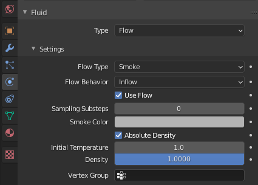
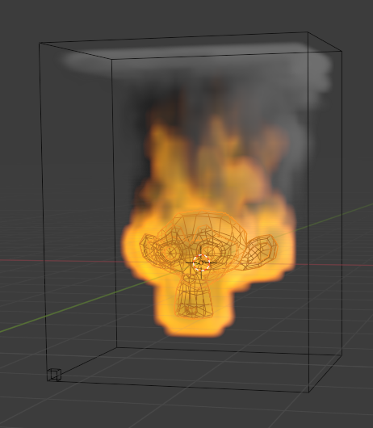
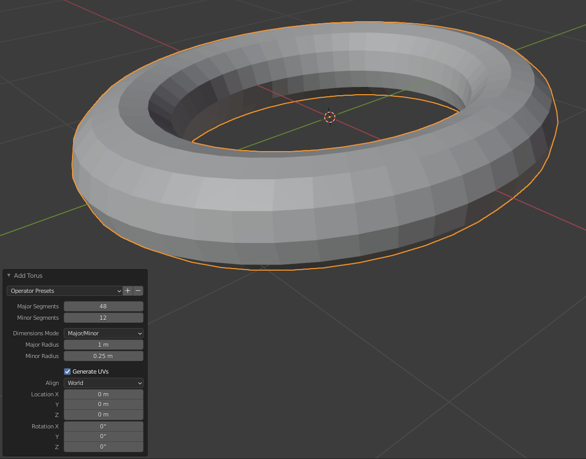
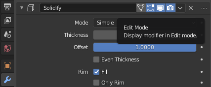
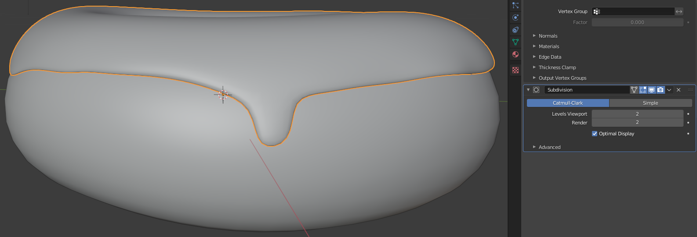
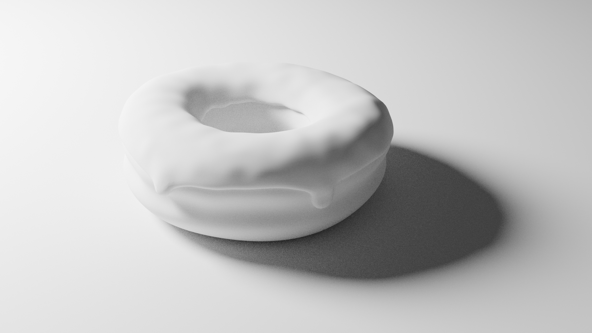

Blender donut tutorial notebook
===============================

This is the notebook I wrote while following Blender Guru's [Blender Beginner Tutorial Series](https://www.youtube.com/watch?v=TPrnSACiTJ4&list=PLjEaoINr3zgEq0u2MzVgAaHEBt--xLB6U). Along with lots of notes taken straight from the videos, it includes notes on the various things that I got confused about and how I resolved those issues.

There are no affiliate links in this notebook and all credit goes to Andrew Price (aka Blender Guru). This notebook is not meant to be standalone - it's my notes to go with the videos.

If you're interested in a quick visual summary of the process covered here see [`journey.md`](journey.md).

To get the latest version of Blender go to the Blender [download page](https://www.blender.org/download/).

I used Blender version 2.92 while the videos use Blender 2.8 (see [here](https://www.blender.org/download/releases/) for the release history) so things look a little different between the two.

Blender can be used with a trackpad and keyboard without number pad - but a number pad and a mouse with a scroll wheel (that can also be used as a third button) seem to be _near_ essential.

As an enthusiastic Mac user, this setup isn't very normal for me. And even on other platforms, I've used scroll wheel mice but rarely, if ever, used it as a clickable third button. Similarly, I've never used the NumPad even when available. As a software developer, I do use the function keys in my IDE but I can imagine many people have never touched them. However, in Blender, I've found myself continuously using the third mouse button, the NumPad and the function keys (or, to be more precise, just `F12` so far).

Learning the shortcut keys is also pretty essential or you end up spending all your time looking for things in menus.

Some abbreviations:

| Abbreviation | Meaning |
|--------------|---------|
| LMB | left-mouse button |
| MMB | middle-mouse button |
| RMB | right-mouse button |

Level 1, Part 1 - the basics
---------------

The default layout consists of a camera on the left, a cube in the middle and a light to the right.

The camera and light are irrelevant for the moment.

Click on the box and try:

| Action | Key |
|--------|-----|
| Move   | g   |
| Scale  | s   |
| Rotate | r   |

Just press the relevant key, e.g. `g` on its own, you don't use these keys in combination with `ctrl`. Think of `g` as grab.

After pressing `g`, `s` or `r`, try pressing `x`, `y` or `z` to snap to moving in a particular axis - or press the `MMB` and move to snap to the desired plane.

**Update:** I misunderstood how the `MMB` works at this point. Press `g`, then, before you start moving, press the `MMB` - it'll immediately snap to a particular axis but, if required, with the `MMB` still pressed move the mouse to select a different axis, once you have the desired axis release the `MMB` and then move with the object snapped to that axis. Press the `LMB` to finish the movement or the `RMB` (or `esc`) to cancel it. A little confusingly, the object moves while you're selecting an axis but once you've selected an axis any movement on the other axes is reset, i.e. in the end, your only movement (relative to the original position) is on the selected axis. For more on this see the [axis locking types](https://docs.blender.org/manual/en/latest/scene_layout/object/editing/transform/control/axis_locking.html#axis-locking-types) documentation (where you can see that you can also lock to a plane with `shift-MMB`).

**Update:** you can enter angles when using `r`, e.g. try pressing `r` and then type `180` and left-click or press `Enter` to finish. You'll see the number building up, as you type it, in the upper-left corner of the viewport. Similarly, if you wanted to scale by two in the y-axis, you can enter `s`, `y`, `2` and `Enter` to finish.

There are all kinds of other movement tricks to be learnt, e.g. holding down `shift` while dragging a grabbed object gives you more fine-grained control.

Moving your viewpoint:

| Action | Key |
|--------|-----|
| Orbit | MMB |
| Pan | shift-MMB |
| Zoom | scroll-wheel |

Just click on an empty area of the scene and press and drag with the `MMB`.

Miscellaneous:

* `.` on NumPad - select an object and press NumPad `.` to focus the view on it.
* `shift-A` - go to the _Add_ menu and select the _Cube_, then delete it by pressing `del` and replace it by using `shift-A` to pop up the _Add_ menu directly.
* `F3` - search for any Blender action in any menu etc.

Focus with NumPad `.` is good for getting the item you're interested back in the center.

TODO: you don't really need to be able to move well in 3D until quite late in the series - but it might be worth finding a video on training to move in 3D. See the note about this in section on moving the light.

### Flaming monkey head

* `del` the cube, `shift-A` and select _Monkey_ (last item in _Mesh_ menu).
* `F3` and search for "quick smoke"
* Important: reselect the monkey head, i.e. don't leave the smoke box as the currently selected item.
* Now to the right select the _Physics Properties_:

* Go to _Flow Type_ and select _Fire + Smoke_. And in the area below the main view, press the play button.

Level 1, Part 2 - modelling
---------------

Go to _File / New / General_. `del` the cube. `shift-A` and select _Torus_ from the _Mesh_ menu. At the bottom-left of the view is an _Add Torus_ item that you can expand:

Oddly, if you click away from the torus, this item is gone forever - it's only available when you add the torus.

**Update:** it's not gone forever - go to the main _Edit_ menu and select _Adjust Last Operation_.

Panels like the _Add Torus_ panel are called _operator panels_. In this panel, select:

* 28 major segments
* 12 minor segments
* 0.05 major radius
* 0.026 minor radius

Note: you can e.g. enter `5cm` rather than `0.05`.

You're looking for your segments to be roughly square (for reasons that become clearer much later). Selecting huge numbers of segments makes your life harder when manipulating the object and isn't needed for a smooth final object.

To the top-left you'll see an _Object Mode_ drop-down. To the right of that you've got _Select_ and other things that aren't, at first glance, obviously menus - but they are. So you've got _File_ and the other menus above and these additional menus here - we won't be doing anything with them at the moment, it's just important to know they're there for later.

Switch from _Object Mode_ to _Edit Mode_ - use `tab` to switch back and forward between the modes.

In _Edit Mode_ click on one the vertices, then `g` and move the mouse around. Press `esc` or the `RMB` to abort an action like this.

What we want is to move a vertex along with those around it - we can do this with _Proportional Editing_:

**Important:** the snap-to (magnet) and the proportional editing (dot within circle) items consist of two parts - the right of each consists of a drop-down menu and you can change what's selected, e.g. from _Smooth_ to _Sharp_ without actually turning on the item itself. So later in this tutorial, I only later discovered that I was changing the snap-to options without actually enabling snap-to itself!

Make sure that the left-hand side of the item (in this case the dot within the circle) is clearly selected:

Here proportional is on but snap-to is off (we'll get to snap-to later).

Now if you click a vertex, then `g` and move the mouse, the whole torus moves - this is because the area or vertices affected by proportional is actually larger than the entire torus.

To change this you have to dial down the radius of influence - this is a bit annoying, our donut is very small and the radius of influence starts very larger - I haven't found a way to e.g. snap it down such that it's immediately visible in the main view.

So select a vertex, press `g`, you'll see _Proportional size_ above the main view, it'll start at 1.00. Dial the scroll wheel until you've got that value down to around 0.06 and the circle of influence can clearly be seen.

Now pan and orbit around the torus and pick random vertices and pull them here and there to create something a bit more organic and donut like.

`tab` back to _Object Mode_ and right-click the donut and select _Shade Smooth_. It looks way better but look at the orange outline of the donut, we've still got the straight lines of the segments - to resolve this click the spanner icon to the right for _Modifier Properties_, click _Add Modifier_ and select _Subdivision Surface_.

Straight away things look smoother - `tab` back to _Edit Mode_ and you can see how the donut is now contained _within_ the wireframe.

Level 1, Part 3 - modifiers
---------------

Use the NumPad keys `0` to `9` to get different perspectives, in particular:

| Perspective | Key |
|-------------|-----|
| Front | 1 |
| Right | 3 |
| Top | 7 |

We want to select the top-third of the donut - if we just click and drag and outline, we'll just select the vertices that we can see.

Note: I find pressing `1` and `.` on the NumPad great for getting the current object nicely re-centered if I've been panning and orbiting around.

So switch into x-ray mode (the upper-right icon of a square offset from a dotted square):

And then drag and select the top-third of the donut:

Now `shift-D` to duplicate the selected vertices, if you move the mouse you'll now drag this duplicated mesh around. If you do that press `esc` to cancel the move.

Note: when you use `shift-D`, you also automatically grab the duplicated mesh - we don't want that so either click (without moving) or press `esc` to release the object. You won't be able to press `p` (next step) until you do so.

Even though we can move this duplicated mesh around independently of the original donut, it's still part of the same object. We want an independent object.

Press `p` to bring up the _Separate_ menu and select _Selection_. Now in the upper-left, you'll see we have "Torus" and "Torus.001":

Double-click "Torus" here and rename it to "Donut" and double-click "Torus.001" and rename it to "Icing".

Note you can also just select the particular item in the main view and press `F2` to rename it.

**Important:** I managed to mess up this duplication step in various different ways, e.g. separating the top of the donut mesh rather than duplicating and then separating the duplicated mesh or dragging the mesh after duplicating and getting into a confused state or duplicating twice without realizing. It was only when later steps didn't pan out as expected, e.g. an unexpected additional surface becoming clear, that it became obvious that I hadn't completed this step completely correctly.

If you `tab` back into _Object Mode_, it's interesting to see how the bottom edge of the icing "clings" closer to the mesh than the underlying donut (see how it extends out beyond the donut at the right and left):

At around 9:36 in the video, Andrew starts talking about setting the _Clip Start_ value if Blender clips your donut strangely when you zoom in and out. You do this by pressing `n` to pop out the side menu, going to _View_ and adjusting the _Clip Start_ value down to 0.01m. However, in my version of Blender it'd already defaulted to this value and I didn't need to adjust it.

Aside: you can pop the side menu back in with `n` again - it took me a while to work out how you can do this, if you want, with the mouse. If you go to the left edge of the menu, you'll see a horizontal resize cursor - if you click now, you can drag the menu until it's hidden. There are various other menus that also work like this - there's a tiny arrow to show their presence when hidden which can be clicked to expand them but no obvious corresponding element to hide them again.

At the moment, the icing is an infinitely thin layer on top of the donut - to give it some thickness, select the icing, then go to the _Modifier Properties_ (spanner icon) and select _Solidify_.

It's worth orbiting around the object and looking at the selected outline to try and work out what has happened, use `ctrl-Z` and `ctrl-shift-Z` to undo and redo so you can see the outline before and after adding the solidify modifier. You'll see you now have effectively an inner and outer icing layer that are joined together to create an object with _thickness_.

Now change the _Offset_ value from -1 to 1 - this will push the icing out from the donut rather than into it. And adjust the _Thickness_ down to a more reasonable 2.5mm (you can type in 2.5mm and it'll convert it to meters).

Note that the inner surface of the icing is still somewhat separated from the underlying donut:

The order of the modifiers matters. You can drag the modifiers relative to each other, just grab the drag icon in the title area of the given modifier (the drag icon is the 2x4 block of dots to right of the X icon that would remove the modifier) and move _Solidify_ above _Subdivision_.

Drag the _Solidify_ modifier up and down relative to _Subdivision_ to see what effect this has. You can clearly see that dragging it to the top changes the edge between the inside and outsider layers of the icing from straight and flat (like the edge of a plank of wood) to _something else_.

In the video, Andrew describes this _something else_ as a rounded edge - to me, it looks more like the inside and outside layers taper together to a sharp edge (rather than the edge being a surface in its own right). Anyway, it looks like this:

Note: turn off x-ray for this more solid view. Looking at it like this, the icing edge looks quite sharp, to me, at the left and right sides but it's clearly curved when looking straight on at the middle. Drag the modifiers up and down relative to each other, pan around and see what you think.

Level 1, Part 4 - modelling
---------------

So having turned off x-ray (shortcut `alt-Z`), select the icing and `tab` to _Edit Mode_ - you only see the edge of the icing mesh sticking out beyond the solid icing.

To see the full mesh for the icing we want to disable the solidify modifier _while in Edit Mode_. To do this go to the modifier and _unselect_ the _Edit Mode_ icon (the square with four squares at its corners, the upper-right one being solid).

The donut is fine but we want to increase the number of faces for the icing so that we can do more fine-grained work when producing icing dribbles. So press `a` (to select all vertices of the item that your currently editing), right-click and select _Subdivide_. To the lower-left, you'll see a _Subdivide_ item, leave _Number of Cuts_ as it is but increase _Smoothness_ from 0 to 1.

TODO: what exactly is the _Smoothness_ setting modifying?

Click somewhere on the background to unselect the icing if it's currently selected. Then `alt-LMB` an edge between two vertices that are part of the bottom edge of the icing - `alt-LMB` will select all the vertices of the edge.

Now, `ctrl-I` to invert the select, i.e. select all vertices except the edge. You can also invert by going to the _Select_ menu (it looks like a button below the main menu bar but it's actually also a menu) and selecting _Inverse_.

Then `h` to hide these vertices. You can unhide them with `alt-H`.

Note: hide and unhide appear to be global (you can find them in the _Mesh_ menu under _Show/Hide_). Even if you click away from the icing and e.g. select the donut, `alt-H` will still reveal the hidden vertices of the icing.

Make sure _Proportional Editing_ is enabled, click a vertex on the edge of the icing, press `g` and drag downwards - something odd happens, the edges ends up being dragged through the surface of the donut. See the edges here that are partially below the surface of the donut:

To fix this select _Face_ from the _Snap_ options and, importantly, actually enable _Snap_.

You also need to select _Project Individual Elements_ - this means that the snapping applies not just to the vertex that you're directly dragging but also the ones that are dragged along with it.

Note: at first, stupidly, I selected _Face_ and didn't notice for a while that I'd just changed the _type_ of snapping but hadn't actually turned on snapping itself (you have to select the magnet icon so it's active like the proportional icon to its right).

This doesn't totally solve things, if you drag a vertex way down onto the under-surface of the donut:

If you pan around you can see that the vertices are on the surface of the donut, as desired, but it's only the edge of the icing that's on the surface - it doesn't take into account that the donut curves outwards between the left and right extents and top and bottom extents of the shape we've dragged out - so the _surface_ of the icing still submarines even if the edges themselves don't.

But if we don't drag things too far, it works well. So change the proportional editing from _Smooth_ to _Sharp_, dial the proportional circle of influence down to a little larger than the thickness of the donut and click and drag a few vertices around the edge of the icing to create a more natural edge, i.e. not perfectly straight.

Once the edge of the icing is a little bit more natural, it's time to add more dramatic dribbles.

Go back to smooth for _Proportional Editing_ and now at points along the edge that are already hanging down a little, select two adjacent vertices (either shift-click them or drag a bounding box to select both). Press `e` to extrude and drag the two points - you'll drag out two new points from the selected points (compare this with what happens if you turn off _Proportional Editing_ and use `g` instead - which will just drag around the existing points).

If you `tab` to _Object Mode_, these dribbles look far more jaggy than the nice smooth dribbles in the video.

I resolved this by going to the _Subdivision_ modifier and increasing the _Levels Viewport_ from 1 to 2:

TODO: when Andrew introduced _Subdivision_, he said 1 would be fine, maybe he just missed mentioning it should be increased for this situation?

`tab` back and forward between _Object_ and _Edit Mode_ to see how your dribbles turn out as you add them.

Once done, if you now zoom in on the dribbles, you'll see they don't hang off the donut surface rather than hugging it:

To fix this, select the icing, go to the _Solidify_ modifier, expand the _Edge Data_ section and change the _Crease Inner_ value from 0 to 1. This introduces a crease that causes the icing to hug the donut.

TODO: so the vertices of the edge were supposed to snap to the surface of the donut when we enabled _Face_ snapping, so why did the extruded vertices extend away from the donut instead of also snapping to its surface?

Level 1, Part 5 - sculpting
---------------

We're going to up the detail in this part. But first let's back up what we've got.

Turn off _Snap_ (the magnet icon), select both the donut and icing, `shift-D` to duplicate and drag the duplicate away a little - you'll see "Donut.001" and "Icing.001" selected in the _Scene Collection_ (upper-right). Now press `m` (for move), select _New Collection_ and call the collection "Archive". Rename the ".001" bits to "_original" if you want. Untick the checkbox to the left of the "Archive" eye icon to exclude this collection from the view.

Now, select the donut, go to the _Subdivision_ modifier, increase the _Levels Viewport_ from 1 to 2, click the down arrow in the modifier header and select _Apply_ (or just press `ctrl-A`).

Note: you can't select _Apply_ if you're in _Edit Mode_ - for whatever reason it's only selectable in _Object Mode_.

What's going on here? If I increase _Levels Viewport_, I immediately see the outline of the donut getting smoother, so what is _Apply_ doing - other than rather surprisingly making the modifier suddenly disappear forever? Andrew alludes to this in the video by saying once you press _Apply_, you can't go back, i.e. you can't adjust the values back down (but you can still do _Undo_) because they're no longer there to adjust.

According to the [manual](https://docs.blender.org/manual/en/latest/modeling/modifiers/introduction.html) pressing _Apply_:

> Makes the modifier “real”: converts the object’s geometry to match the applied modifier’s results, and deletes the modifier.

What this means is that the geometry that is generated will be accessible in _Edit Mode_. If we look back at increasing _Levels Viewport_ for the dribbles, this increased the smoothness in _Object Mode_ but had no effect on the number of vertices in _Edit Mode_. Now if we `tab` to _Edit Mode_ we see that the number of vertices has doubled.

TODO: how was this better or different from right-clicking on the object and selecting _Subdivide_ like we did previously for the icing?

Now, switch from _Layout_ to _Sculpting_ (see buttons with these names in the main menu bar).

Zoom in on the donut and press `f` whenever you want to adjust the size of your brush. You'll see the tool settings (_SculptDraw_ etc.) just below the main menu bar (unlike the video, these now appear automatically in the 2.9 versions of Blender and also, unlike the video, x-symmetry is not automatically selected).

Note that instead of clicking and releasing to select a field and enter a value, you can:

* Hover over the field, click but don't release and drag left and right.
* For more fine-grained control, hover over the field and hold `ctrl` while turning the scroll wheel.

Try these with e.g. the sculpt _Strength_.

Try pulling out the surface by clicking dragging the mouse back and forward over the donut surface, `tab` to edit mode and pan around to see how it looks then undo.

Andrew sets _Radius_ to 115px and _Strength_ to 0.26 and then uses `ctrl` and dragging to push in (rather than pull out) to create a recessed "belt" around the donut. However, his donut seems to have gotten bigger since the first video - I had to reduce the radius down to around 40px to get the same relationship between the size of the brush and the donut.

Andrew points out that the experience is "so much better with a stylus". Maybe, something like this [Wacom Intuos M](https://www.digitec.ch/en/s1/product/wacom-intuos-2540lpi-graphics-tablets-7856832) - note if used with Linux, you have to manually tell it not to misdetect the OS as Android (as described [here](https://github.com/linuxwacom/xf86-input-wacom/wiki/Known-Issues#android-misdetect)).

He feels it's still not detailed enough. So back to _Layout_ mode, select the donut, go to _Add Modifier_ and select _Subdivision Surface_ - the important value is _Levels Viewport_, leave this as 1 and select _Apply_ as before. If you `tab` to _Edit Mode_ you can see we've got even more vertices now. Then go back to _Sculpting_ and continue working on the belt.

Then add a belt on the inside of the donut hole - but just a single light brush pass.

Now onto the icing. Select the icing and hit _Apply_ for the _Solidify_ modifier (removing it and carrying its settings over into the real geometry).

`tab` to _Edit Mode_ - you just see the parts of the mesh that we didn't hide previously.

**Important:** unhide the rest of the icing mesh with `alt-H` before proceeding.

Select the whole mesh with `a` (not really necessary but looks nice), now in the _Subdivision_ modifier, increase the _Levels Viewport_ from 2 to 3 - we want super fine detail for the icing, click _Apply_ (again you have to `tab` to _Object Mode_ to be able to click _Apply_ and then `tab` back to see the result).

Back to _Sculpting_, select the _Inflate_ brush and use it to add some extra weight to the bottom of droplets. Three or so passes on the bigger droplets and fewer on other little areas along the edge as takes your fancy.

Then add a tiny bit of raggedy-ness to the inside edge of the icing, i.e. around the hole, with the _Grab_ brush (`shitft-space` and then `g`). Note: Andrew massively ups the _Strength_ for this step to 1. Then he does a single brush around with the _Inflate_ brush (it's strength is at 0.5).

That's the edges done, now the final step for the icing is the surface of the icing, for this he reduces the _Strength_ down 0.24 and chooses the _Draw_ brush (`shift-space` then `x`) and makes small circular motions all over the surface (sometimes holding down `ctrl`).

At all points, he uses the _Smooth_ brush (`shift-space` then `s`) to fix things up if he goes too far with the other brushes.

Now back to _Layout_ mode, to pull these weird overhangs in against the donut:

Enable _Proportional Editing_ with _Smooth_, then looking at the dribble side-on grab a point on the underside of the dribble and pull it toward the donut surface. I couldn't get rotate, i.e. `r`, and grab, i.e. `g` to work in combination as he did - the best I could do was first use `r` to rotate the underside of the dribble to be more in line with the donut surface and then use `g` to grab the dribble and pull it onto the surface of the donut and even a little bit beyond so that most of the edges of the dribble were at or below the surface of the donut. Once you've pulled the dribble near enough, you can cleanup by going around the edges and pulling them in onto the donut.

TODO: how was Andrew using `g` and `r` in combination in this bit?

Level 1, Part 6 - rendering
---------------------------

We've been working with _Viewport Shading_ set to _Solid_ so far (the selected solid disc, upper-right here):

Now, select _Rendered_ mode, i.e. the disc that looks like a shaded pool ball, two to the right of the solid one, or press `z` to bring up the _Shading_ pie menu and then `8` for rendered (`8` is shown on the menu, no need to remember).

In this mode the camera (left) and the light (right), that were briefly referred right at the very start, come into play:

But they're very far away from our relatively small donut. So select and grab the light (with `g`) and bring it in much closer to the donut:

Here, you see that the light is the scene's light source and that the back of the donut, facing away from this source, is in shadow (as you'd expect).

Aside: up until this point there's been very little of dragging things about in 3D space - it's actually quite hard. Dragging the light to the desired location wasn't easy - training on how to use `g` with `x`, `y` and `z` and other tricks to get things where you want would probably be worth a video in its own right. Like those training intros you get on moving about in 3D shooters.

Drag the scene around so you clearly see the relationship between the light and the shadows on the donut.

It turns out that the odd red-and-white dashed circle where the axes meet isn't just decoration, it's the 3D cursor:

When you add a new shape, it's the location of the 3D cursor that determines where it gets dropped. You can move its location with `shift-RMB` - you can drag or just click. And `shift-C` to move it back to its default location at the meeting point of the axes.

That's just for information - we're going to add a new shape but we don't need to move the 3D cursor for this.

We're going to add a plane for the donut to sit on - so that we can see the shadow cast by the donut on something else, to make things more interesting. So `shift-A` and select _Plane_ from the _Mesh_ menu.

Aside: I'm pretty sure Andrew increased the size of the donut at some stage so that it doesn't look quite so tiny relative to the default size of new shapes like this.

The plane bisects our donut - we want to now move the donut so it sits on the plane. We could shift-click and select both donut and icing, to move them together, but let's link them together properly via [parenting](https://docs.blender.org/manual/en/latest/scene_layout/object/editing/parent.html).

First click to select the child object (the icing), then shift-click the parent object (the donut) and press `ctrl-P` and select _Object (Keep Transform)_ (Andrew says he always uses this variant as plane _Object_ doesn't always do what you expect in more complex situations). Now "icing" is moved in under "donut" in the _Scene Collection_:

Now, you can grab the donut and the icing move with it. I clicked the donut, then pressed `.` and `1` on the NumPad to get a front on centered view, then `g` and moved the donut to sit nicely on the plane (note that you can use the arrow keys, rather than the mouse for precise movement of a grabbed object). Andrew just free-handed this step without switching to the front view.

Here, you can see only one side of the donut is touching the plane, you can fix this with `r` and further use of `g`. Go to the side view with NumPad `3` and do the same there.

If we move around, it becomes clear that we have a very strange shadow for a donut that's supposedly sitting on the plane:

How are we seeing what looks like light through the donut hole _behind_ the donut? It turns out this is all down to the real-time renderer that's being used.

Note: Andrew sees no shadow at all at this stage.

So select the light and then go to its _Object Data Properties_:

First, reduce the _Power_ value to 40W so everything isn't so washed out, then expand _Shadow_ and tick _Contact Shadows_. Things look a lot better now:

Note: Andrew still sees barely any shadows at this stage - presumably the real-time renderer has gotten better shadow support since Blender 2.8.

So let's switch from the default real-time render engine, called _Eevee_, to _Cycles_ (which is described in the Blender documentation as a physically-based [path tracer](https://en.wikipedia.org/wiki/Path_tracing)). Go to _Render Properties_ and change the _Render Engine_ from _Eevee_ to _Cycles_:

Above, you can see _Device_ is set to _CPU_. If you've got a decent graphics card you'll get much better performance if you switch this to _GPU Compute_. If no _GPU Compute_ option is available, go to _Edit / Preferences..._ and then _System_ and the _CUDA_ tab and make sure your Nvidia graphics card is selected there:

If you've got a super new Nvidia RTX graphics card then it should be selected under the OptiX tab rather than _CUDA_ and if you've got an AMD graphics card then it should be selected under _OpenCL_.

**Update:** I eventually bought an RTX card and initially didn't have it chosen under the OptiX tab. Switching to OptiX had a dramatic positive effect on my render times but the first time I did a render, I thought Blender had hung. Instead of rendering, it sat and did nothing but if you look closely, in the render window, you can see the text "Loading render kernels (may take a few minutes the first time)". It took several minutes, for me, and more than made up for it in render speed afterwards. Once the kernels have been loaded once they don't have to be reloaded even if you quit and restart Blender.

TODO: however, if you reboot your machine, I think they then get reloaded - confirm if this is the case.

**Update:** you can also select your CPU under the _CUDA_ or _OptiX_ tabs - on my system, a donut render, that took 35s without CPU being ticked, took 25s when the CPU also contributed. On Blender 2.93, I find it forgets the CPU setting everytime Blender is restarted. It's fairly clear if the CPU is contributing as you can see multiple tiles being rendered at the same time when you do high quality renders.

If you haven't got either an Nvivida or an AMD graphics card then you just have to use _CPU_. My cheap Nvidia GT 730 card is barely faster than _CPU_ anyway.

Aside: I experienced issues, on my Ubuntu system, with CUDA disappearing after waking from suspend - there are notes on this and on installing the latest Nvidia driver in [`nvidia-linux.md`](nvidia-linux.md).

Once using _Cycles_, we, straight away, get a more interesting looking donut:

When you move things around, you'll see the image get very grainy and then gradually resolve into something better - you can see it counting down through the _Path Tracing Sample_ count in the upper-left corner as it does this:

### Camera

Now onto the camera - the camera defines the view used when you finally decide to fully render a final image of the scene. You can switch to the camera view by pressing the movie-camera icon (bottom-most icon on upper-right below magnify and hand icons) or just press NumPad `0`:

Pressing NumbPad `0` enters camera view, pressing it again exists camera view.

Aside: oddly, the movie-camera icon doesn't highlight when selected and the behavior of the two icons above it is also _interesting_ - click them and nothing happens but click and, without releasing, drag. They're an alternative to using the `MMB`.

Note: when I first clicked the movie-camera icon, the view was so zoomed in that the screen just went black, I had to zoom out dramatically to actually see anything.

**Important:** if you move, using `MMB`, you immediately leave camera view - to change its view you have to use its specific controls. 

### Moving the camera

I found this bit very confusing, I pressed `g` as described in the video but all I ended up doing was moving the donut, or whatever was currently selected, around. I didn't realize you have to have already selected the camera itself before going into camera view (or selecting it, while in camera view, by clicking the anywhere along the edge of the rectangle that represents its view).

So using `g` (and the other actions described in the [camera navigation](https://docs.blender.org/manual/en/latest/editors/3dview/navigate/camera_view.html#camera-navigation) documentation) isn't that strange, it's just that you're grabbing the object, i.e. the camera, that you're looking through.

With the camera selected, you can also zoom while grabbed - i.e. after pressing `g`, press _and release_ the `MMB` then move the mouse (with no buttons clicked) to zoom (rather than using the scroll wheel as you usually would). To finish zooming, click the `LMB` (or to cancel, press the `RMB` or `esc`).

It was only at this stage that I noticed that there's a display of what the mouse buttons and other buttons will currently do in the status bar along the bottom of the main window:

E.g. here you can see that `c` will get you out of the constraints mode that you got yourself into with the `MMB` without having to finish the current `g` operation.

There are easier ways to move the camera. Andrew says that what he generally does is to move around in normal view mode until he gets the view he wants and then press `ctrl-alt-NumPad-0`. Note, a little oddly (IMHO), you don't get quite the view you had, instead it seems to zoom in a little and the camera encloses the center of this area (rather than the whole area).

Or you can press `n` to pop out the side menu, select the _View_ tab and tick _Camera to View_ and then the normal movement controls work to adjust the camera view rather than popping you out of this view:

Both of these approaches seem much easier than using `g` etc.

Update: the downside of _Camera to View_ is that I found I kept on accidentally moving the camera while in camera view.

### Render

Once you've got the camera view that you want you can generate a high-quality render - go to the _Render_ menu and select _Render Image_ (or press `F12`). This pops up a new window and does the render - on my terrible GT 730 graphics card, this took 140s. You can then save the result via _Save As_ under this new window's _Image_ menu (or `alt-S`) and get something like this:

For more even lighting, like sunlight, you have to move the lamp much further away:

And then, to compensate for the resulting falling off in brightness of the donut, dramatically increase the power of the light from our previous 40W to something like 500W.

### Material

To finish off this part of the tutorial, select the plane, go to the _Material Properties_:

Click _New_ and then a whole array of settings appear, just go to _Base Color_ and click its color area (currently grey) and enter e.g. 0.6, 0.8 and 0.9 (for the H, S and V values respectively) for a light blue color.

Now generate a render (once you've got the camera view you want) with `F12`, with some color in the scene, it's interesting to see how the blue of the plane also affects the color of the donut:

Level 1, Part 7 - materials
---------------------------

Note: at this point things start getting frustratingly slow if you don't have a good graphics card - I upgraded to a system with an RTX 2060 (it required a system upgrade as the power supply on my old system could provide a total of 300W whereas the RTX 2060 can draw up to 250W on its own - in contrast to an older card like the GTX 1050 Ti that just draws at most 25W).

Now, we're going to add a material for the icing. As with the plane, select it, go to _Material Properties_ and click _New_.

Andrew notes that only the following properties are ever commonly used:

* _Base Color_, e.g. 0.88, 0.35 and 0.9 HSV values for pink.
* _Roughness_ - how sharp the reflection looks - 0 is like a mirror, 1 is like chalk. Try 0.34 for icing.
* _Normal_ - this comes into play with bumpy surfaces and will be covered later.

Note: it's important to be looking at the donut from the right angle (as in the video with the light very much top-left) to really see how roughness affects things. As there's nothing to reflect in this scene, 0 actually looks less reflective than e.g. 0.3 where the donut becomes more obviously shiny.

Andrew notes that beginners often adjust the _Specular_ value to turn down reflection when they should be using _Roughness_.

Less common materials, like many foods and skin, where light also enters and scatters below the surface (think of holding a torch in front of your fingers), have a characteristic called subsurface scattering which you adjust with:

* _Subsurface_ - adjusting this on its own is kind of an odd affect but its clear something interesting is happening, try 0.3.
* _Subsurface Color_ - this makes things more normal, Andrew adjusts this to something very close to the _Base Color_, i.e. 0.94, 0.33 and 0.9 HSV values, but it isn't clear if you should aim for an identical color and what you should be aiming for otherwise.
* _Subsurface Radius_ - how far the light bounces around inside the surface. There are three values - for the red, green and blue channels. Here Andrew goes for 0.3, 0.15 and 0.15. Again it's unclear, how exactly these values are chosen.
  
Note: the values above, e.g. for _Subsurface_ are the final values Andrew chose rather than the initial ones he tries.

### Renders

Here are some renders that show how the addition of each of the above settings affects things.

_Icing without material._  

_Icing with base color._  

_Icing with roughness._  

_Icing with subsurface._  

_Icing with subsurface color._  

_Icing with subsurface radius._  

### Overlays

When not in camera view and working with materials, all the overlays, e.g. camera, light, 3D cursor and the outline of the currently selected object, can be distracting.

You can turn them off by unselecting the _Show Overlays_ icon (solid disc offset from circle outline):

**Important:** toggling off _Show Overlays_ hides a lot of things - in later steps I got confused as to why I wasn't seeing something I expected to see, e.g. the orange outline indicating that something was selected, and it turned out it was being hidden because _Show Overlays_ was off.

### Donut material

In the future, we'll give the donut a proper texture - for the moment we'll just give it a basic material.

So select the donut and give it a material with:

* _Base Color_ 0.08, 0.44 and 0.9 for HSV.
* _Subsurface_ 0.1 (a lot less than the icing but still a little).
* _Subsurface Color_ 0.09, 0.31 and 0.9 for HSV.
* _Subsurface Radius_ 0.1 for all three values.

Unlike the icing, roughness is left unchanged.

### Splitting the view

We want to be able to see both the camera view and a view in which we can move the light and the camera - so let's split the view.

Just go to any of the view's borders where you see the resize cursor:

And then right-click, in this case select _Vertical Split_ and then drag and click where you want the split. Note: the right-click menu doesn't always show for me and sometimes I have to click around a bit and then retry.

An easier, if initially somewhat confusing way to split things, is to go a corner until the cursor turns into a cross-hair and then drag:

E.g. go to the upper-left corner as shown, click and drag right. I found it easy to create new views but removing them was more of an issue. The trick seems to be - if you drag the cursor into the view containing the corner then you split that view, however, it you drag the cursor outward towards another view then you'll see a large arrow appear indicating that you'll join with, i.e. replace, that view.

If you just right-click in the small gap between two views then you get a menu that also allows you to join views.

Currently, the small light source produces a hard sunlight-like effect. So with the view split we want to increase its size to get a softer effect. Expand the light source size way up and you'll see the shadow of the donut getting much softer.

Try a _Size_ of 0.45m and a slightly reduced _Power_ of 330W.

### Color management

Andrew mentions that he'll do much more on color in another series and says that he uses a [Spyder](https://spyderx.datacolor.com/) to calibrate his monitor.

However, for the moment a quick way to check that things look OK is to go to _Render Properties_, expand _Color Management_ and temporarily switch _View Transform_ from _Filmic_ to _False Color_.

Here, you can see things overexposed at 500W:

Andrew says you're aiming for a more grey tone for the center of interest (in this case the icing) and you want to wind things down so that at most there are just a few over-exposed/blown-out areas, as here with 330W:

To be honest, I'm not entirely sure what Andrew means by grey in this context but I can see that adjusting down the Wattage reduces the blown-out red areas. _Maybe_ red is highlighting "bad" areas and green "good" areas with a grayish green being what you're aiming for.

### Plane color

Andrew did split testing and found people preferred pink-on-pink, so try changing the plane color from blue to e.g. 0.86, 0.27 and 0.9 for HSV.

### Reducing noise

As noted way above, whenever you change something, you'll see the _Path Tracing Sample_ counting up to 32 as Blender gradually re-renders the view. If you go to _Render Properties_, under _Sampling_, you'll see this 32 as the _Viewport_ value and also see 128 as the value used for high quality renders. This affects how noisy things appear and even at 128 samples you still see some noise in the high quality render - but upping it further, e.g. to 256, gets very expensive time-wise and doesn't completely resolve the problem anyway.

Instead, it's better to use a denoiser. Go to _Layer Properties_ and tick _Denoising Data_:

At this point, Andrew switches the _Viewport Shading_ from _Rendered_ to _Solid_. As covered earlier, he does this with `z` to bring up a pie menu and then `6` to select _Solid_ but you can do it via the icons in the upper-right corner.

Then we need to switch from the normal _Layout_ workspace to the _Compositing_ workspace (see the buttons in the main menu bar).

**Important:** maybe this has changed between Blender 2.8 and 2.9. Initially, I just saw a blank workspace of switching to _Compositing_. You have to tick _Use Nodes_ for the nodes to appear and for the _Item_ tab (on the right edge) to become available. In the Blender documentation, the first thing they say, in the [Compositing Getting Started](https://docs.blender.org/manual/en/latest/compositing/introduction.html#getting-started) section, is to tick _Use Nodes_, so I wonder why it isn't ticked by default.

Andrew says compositing and nodes will be covered properly later. For the moment, we'll just apply a mechanical set of steps to apply denoising to the image _after_ it's been rendered (i.e. denoising isn't part of the render itself). So the steps are:

* `shift-A` to bring up the _Add Node_ menu, go to _Filter_ and select _Denoise_.
* Drag things around such that the new node is between the _Render Layers_ node and the _Composite_ node.
* Click on the yellow disc to the left of _Noisy Image_ (on the _Render Layers_ node) and drag from it to _Image_ on the _Denoise_ node.
* Similarly, connect _Denoising Normal_ to _Nornal_ and _Denoising Depth_ to _Depth_.
* Connect _Image_ on the _Denoise_ node to _Image_ on the _Composite_ node (this will break the existing link to _Image_ on the _Render Layers_ node).

Andrew goes into how you can get this new node layout to be applied to an existing render - something which would be very important if you wanted to try out things with an existing render without incurring the cost of a new render each time.

But the easiest things, is to just re-render (with `F12`) - you'll see the noisy render occur just as before but then once its completed the denoise step is applied and the noise very suddenly disappears.

### Applying changes to an existing render

If you want to apply changes to an existing render then you have to do the following.

Switch the _Editor Type_ from _Dope Sheet_ (which we briefly saw come into play when animating the monkey head with fire in the very first lesson) to _Image Editor_:

And change the linked image to _Render Result_:

Look at the render result, if you've already re-rendered (as suggested above) then you have a nice denoised image. So try connecting the _Image_ output of the _Render Layers_ node to the _Image_ input of the _Composite_ node (so breaking the link to the _Denoise_ node) and you'll see the result instantly update to the noisy version. Then reconnect the _Image_ output of the _Denoise_ node and after a few seconds, you'll see the denoised version again.

Note: you can maximize the area with the render result with `ctrl-space` - this maximizes the area that the mouse is currently over - and just press `ctrl-space` again to change things back to normal.

If you e.g. change something on the _Denoise_ node and want to see the result updated, you have to temporarily drag the connection away from the _Composite_ node's _Image_ input and then reconnect it (all in one action, you don't have to drag and release, just drag away and then connect it straight back on).

### Denoise results

_Render before denoising._  

_Render after denoising._  

Level 2
-------

OK - that's it for level 1. As this page is already quite long the next level has its own page [here](LEVEL-2.md).
