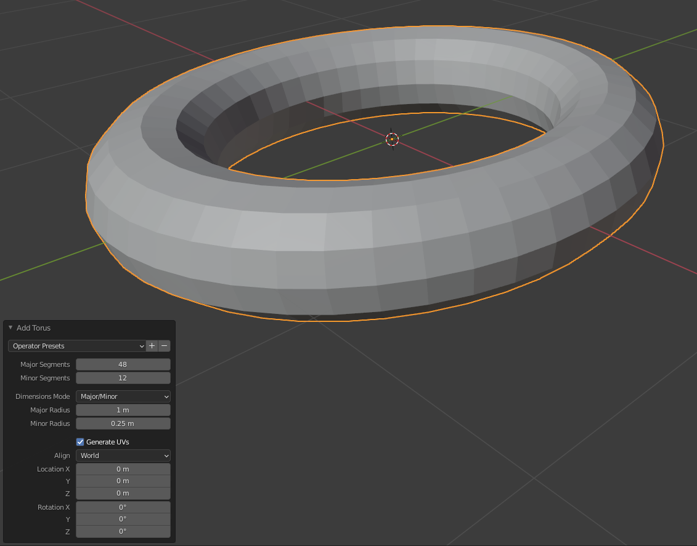
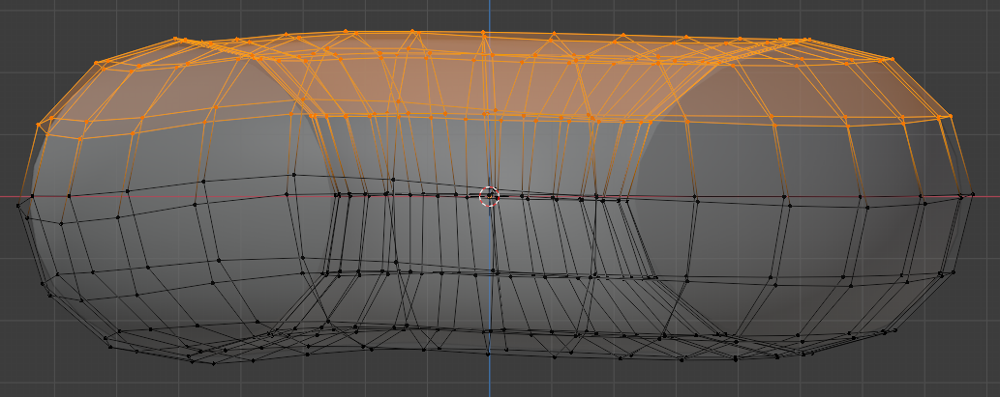
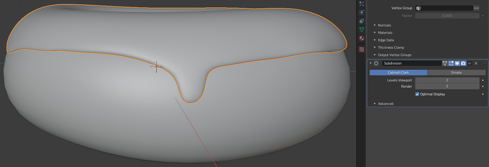
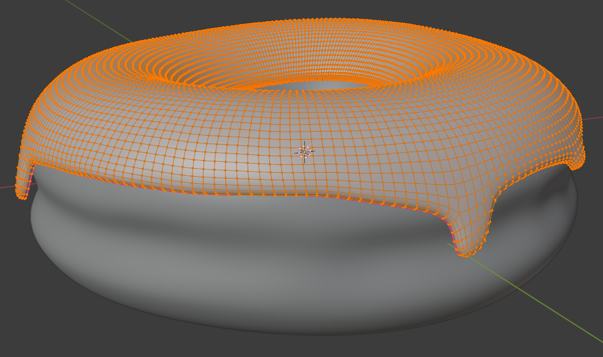
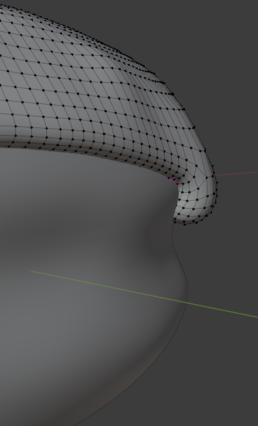
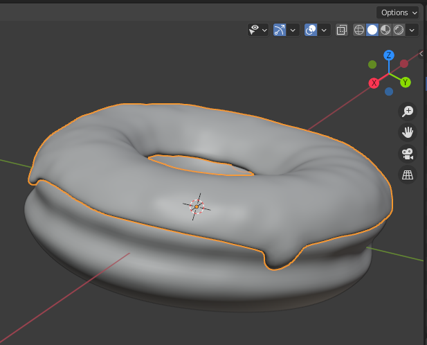
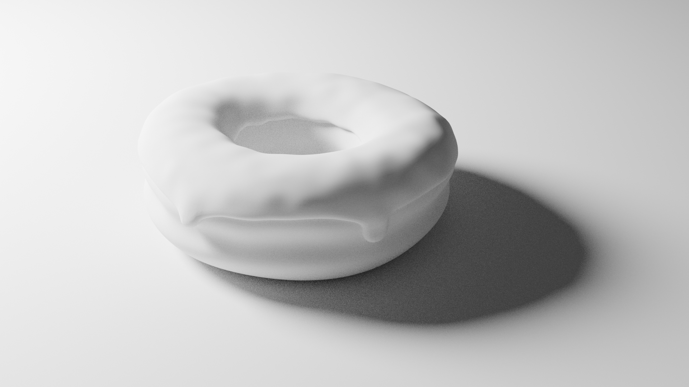
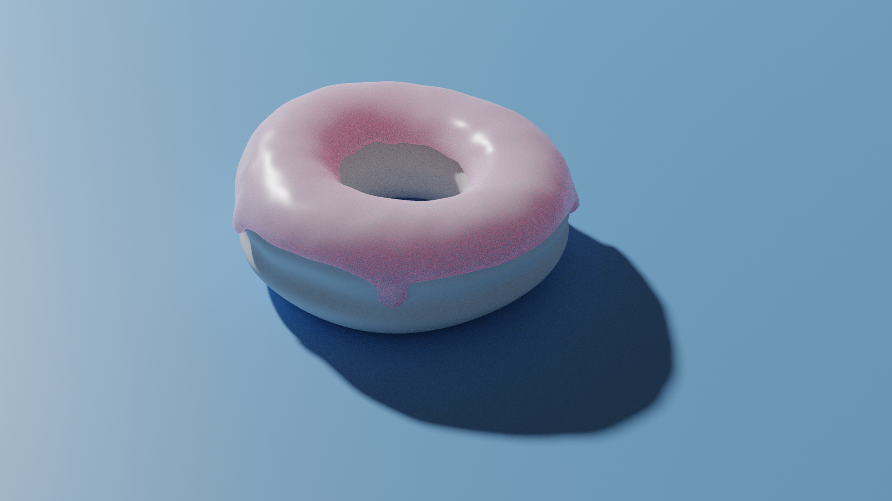
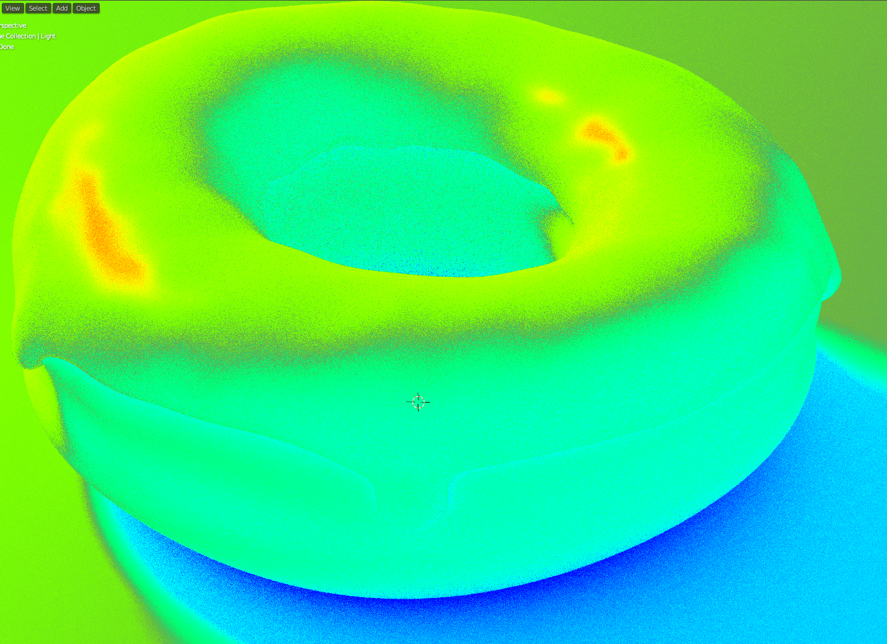

The donut journey
=================

The following is a collection of screenshots, made while putting together this notebook, that describe the journey from basic torus to final donut.

_The initial torus._  

_Selecting what will become icing._  

_Adding dribbles to icing._  

_Working on fine-grained icing mesh._  

_Fixing dribble overhangs._  

_Basic solid view._  

_First high quality render._  

_Render with colors and subsurface scattering._  

_Detecting over exposure with false color._  

_Donut and first sprinkle (far left)._  

_Sprinkle infestation on underside of icing._  

_Weight painting to limit placement of sprinkles._  

_Making weight painting more irregular._  

_A collection of sprinkle types._  

_Donut with sprinkle models (front)._  

_Cutting seams into donut and laying its surface down flat._  

_Painting a basic texture for the donut._  

_Creating programmatic noise for surface blistering._  

_Programming blisters and small scale surface irregularities._  

_Basic render of blisters and fine-grained bumps._  

_High quality final render._  

_Two tiny modifications and the icing becomes radioactive._  

