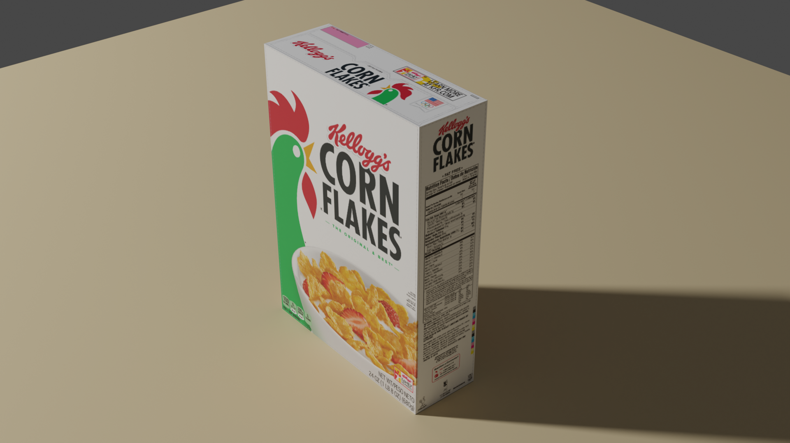

All the unwraps below feature a top to bottom seam around the "tube" of the torus - I won't mention it again, just take it as given.

_Seam around inside of the hole._  

_Seam around outside of the torus._  

_Seam around the top of the torus._  

Aside: I've no idea why the UV maps above don't have at least one axes of symmetry.

The simplest arrangement, I think, is a circular seam around the inside of the hole and then instead of plain _Unwrap_, select one of the other unwrap options - _Follow Active Quads_.

Unlike _Unwrap_, you don't automatically end up with a map that fits within the 0-to-1 space, to resolve this, select the whole map, go to the _UV_ menu, select _Pack Islands_ and then, in the _Pack Islands_ panel that temporarily appears at the bottom of the viewport, untick _Rotate_.

Aside: traditionally, it seems, these little panels, that become available after you perform certain operations, have been called _operator panels_. Even if you've clicked or done something that causes it to disappear, you can get it back via _Adjust Last Operation_ in the _Edit_ menu.

Note: sometimes _Follow Active Quads_ resulted in a map with a twist in it - I could resolve this by going to the _UV_ menu and selecting _Reset_ and then redoing things (but I don't know why the _Reset_ was necessary).

UV unwrapping
=============

First things first, to work with UV maps, you need to switch to the _UV Editing_ workspace. If you've got nothing selected then all you'll see in the _UV Editor_ is what's called the 0-to-1 space:

The name is simple enough - the bottom-left corner has co-ordinates (0, 0) and the top-right corner has co-ordinates (1, 1). You're not forced to keep everything within this space - but not doing so results in confusing result - so when working with UV maps always move and scale the map if necessary to keep it within this space.

If the 0-to-1 space is empty then `tab` to _Object Mode_ and make sure you've got the object you're interested in selected then `tab` to _Edit Mode_ and press `a` to select all its vertices - you should then see the UV map for all the selected faces. If you still don't see anything, make sure you haven't got _Show Overlay_ accidentally toggled off.

Note: If you only select a subset of the vertices then you only see the UV map corresponding to those faces that are fully surrounded by those vertices.

When you add a standard shape, it is created with a UV map where the shape is unwrapped into a reasonable default flat representation. However, this representation doesn't keep sync with changes you make to these objects. So the more you deform or otherwise change the shape, the less appropriate the default unwrapping becomes and you have to re-unwrap it.

_Default cube UV map._  

_Default UV sphere UV map._  

TODO: the default UV map of a torus always seems to include an odd unselected face - I asked about that [here](https://blender.stackexchange.com/q/223588/124535) on the Blender StackExchange - see if I got an answer.

If you go to _Object Data Properties_ and expand _UV Maps_, you see the default UV map associated with the currently selected object:

**Important:** the left-hand _UV Editor_ only shows the _faces_ that are currently selected in the right-hand _3D Viewport_. So, if you've got nothing select in the _3D Viewport_ (use `alt-A` to unselect all) then everything disappears in the _UV Editor_. Or try just selecting a single face and you'll just see that face in the _UV Editor_. This confused me initially.

### Unwrapping a cube

Let's unwrap something simple to start with. Go _File_ / _New_ / _General_ and let's work on the default cube.

Switch to _UV Editing_ and, in the right-hand _3D Viewport_, switch from the default _Vertex select_ mode to the _Edge select_ mode (the shortcut keys for these two modes are `1` and `2` respectively):

Then think about the edges, you'd cut along with a box cutter if you wanted to lay it out flat as a t-shape (rather than the default cross shape seen above).

Click with `LMB` and `shift-LMB` to select all the relevant edges and (with x-ray mode turned on so we can see all edges) you should end up with:

There's nothing special about that white edge above - white just indicates the last edge selected.

At the top of the _3D Viewport_, you'll see to the _View_, _Select_ etc. menus - we're interested in the _Edge_ and _UV_ menus. These menus have the shortcuts `ctrl-E` and `u` respectively (remember `e` is already assigned to extrude).

So once you've selected the appropriate edges, press `ctrl-E` and select _Mark Seam_ - those selected edges become highlighted with thicker red lines.

Then press `a` (it'll only unwrap the faces we've selected so, as we want the whole thing unwrapped, select everything), then press `u` and select _Unwrap_.

**Important:** I got quite confused at various points doing this - nothing would appear to happen when I did an unwrap as I'd have selected edges but have forgotten to mark them as seams or I'd have forgotten to select everything, i.e. `a`, before doing the unwrap.

**Update:** if you're in _Object Mode_ then `a` will select all _objects_, it's only when you're in _Edit Mode_ that `a` selects all faces of the object that you're currently working on.

Notes:

* Some tutorials suggest deleting the existing UV map, i.e. go to _Object Data Properties_ and press minus for the existing map. This isn't necessary - when you select _Unwrap_, you're completely resetting the map to match the seams and faces that you've currently selected. But it doesn't do any harm - when you press _Unwrap_ for the first time after deleting the existing map, it'll automatically create a new map. And perhaps it's less confusing, for some, not to see the existing map when working to produce a new one. You can do more complex unwraps that consist of lots of separate components - in this context deleting the existing map, to completely start from scratch, _may_ be more useful.
* Some tutorials suggest going to the _UV_ menu in either the _UV Editor_ or the _3D Viewport_ and selecting _Reset_. This makes even less sense that deleting the existing map - all it does is reset all the faces so that they lie in a stack on top of each other - try it with the cube - you end up with an oddly greyed out area with four vertices in the _UV Editor_:

It turns out that this is just the six faces of the cube unwrapped into six unconnected faces. If you select the faces separately in the _3D Viewport_ and then select and move them in the _UV Editor_, you'll see you can separate out the faces clearly:

Note: if you just drag vertices in the _UV Editor_ without first selecting an individual face in the _3D Viewport_ then you _sometimes_ end up dragging a vertex associated with more than one face. I'm unsure if such vertices are really shared or if it's multiple vertices sitting on top of each other and I'm selecting all of them at once.

**Update:** I have since discovered situations where _Reset_ did resolve issues. I got myself into situations where unwrapping with _Follow Active Quads_ produced results with unexpected twists in the resulting map and doing _Reset_ and then redoing the unwrap resolved things (why, I don't know).

### UV checker board grid

Sometimes you want to paint directly onto the object in the _3D Viewport_, in which case the relationship between the size of the faces in the _3D Viewport_ and the size of the faces seen in the _UV Editor_ isn't so important.

However, if you're planing to take an existing image and associate it with the UV map in the _UV Editor_ then if there's a mismatch between the size of the faces there and those seen in the _3D Editor_.

An easy way to check for size mismatches, before using your real image, is to use the predefined _UV Grid_. If you've unwrapped a cube as shown above then, in the _UV Editor_, select _New_, enter e.g. "Checker pattern" for the _Name_ and select _UV Grid_ for the _Generated Type_ and leave the rest unchanged:

Then switch to the _Shading_ workspace, and in the _Shader_ editor (where the nodes are, assuming you've got the cube selected), press `shift-A` and, under _Texture_, select _Image Texture_. In the new node, click the image dropdown (to the left of _New_), select "Checker pattern" and then connect the nodes _Color_ output to the input for _Base Color_.

Then switch back to the _UV Editing_ workspace and, in the _3D Viewport_, change the viewport shading to _Material Preview_ (`z` and `2`):

Note: you can have the UV map sticking out beyond the image like this - but the sticking out bit (to the right) is just wrapped round onto the left-hand side of the image which is a bit confusing. So best to move and scale the UV map such that it's completely within the image.

If you look at the faces of the cube, you can see that the checkerboard pattern looks good in all the faces of the cube, i.e. undistorted.

However, if you grab the top face and pull it upwards then the pattern on the sides distorts:

The faces in the UV map are still square and they have to be stretched out to match the faces on the actual object.

This is simple to resolve - in the _3D Viewport_, just select all with `a`, then `u` and select _Unwrap_ again. Now the faces are unwrapped again such that the sizes in the UV map match those of the actual object:

As well as changing the size of faces in the _3D Viewport_, try changing them in the _UV Editor_ and see how things update in the _3D Viewport_.

Note: if you apply transformations, e.g. scaling, to an object, it _may_ be that, even after re-unwrapping an object, the sizes don't match up. To see the transformations for the current object, `tab` into _Object Mode_ in the _3D Viewport_, press `n` to pop-out the side menu and see if e.g. any of the scale values are not 1:

Once, you've got the checker pattern associated with the object, via an _Image Texture_, you can actually unlink it in the _UV Editor_, if you find it distracting when working with the UV faces (just press the x icon, to the right of the image field, in the menu bar of the _UV Editor_). You can even use a different image in the _UV Editor_ - what matters for the object is the image configured in the _Image Texture_ node.

For me, using `s` didn't affect these values - i.e. they stayed at 1 and I didn't have to take any additional steps.

If this is an issue, then go to the _Object_ menu in the _3D Viewport_, then to _Apply_ (or just press `ctrl-A`) and select _All Transforms_ (or e.g. just _Scale_ if its the only issue).

Sometimes, it can be inconvenient that faces disappear in the _UV Editor_ if they're not selected in the _3D Viewport_. To turn this off and at the same time enable selecting faces in the _UV Editor_ such that you can see them selected in the _3D Viewport_, click _UV Sync Selection_ (the two-way-arrows icon):

If you want to see how to take an existing image, like the cereal books, and use it as the image associated with an object and mapped via its UV map then watch this [video](https://youtu.be/GTd8NBg8EZU?t=1496) (the link is set to start at 24m 56s into the video where presenter starts talking about this after having created his UV map).

He uses an open source image editor called [Krita](https://krita.org/en/features/highlights/) but that's irrelevant - you can use Gimp or whatever.

In short - get your UV map laid out in the _UV Editor_, `a` to select the whole map, go to the _UV_ menu, select _Export UV Layout_, adjust the size values to be similar in size to the image you intend to use (like the cereal box image above), some sources say it's best to choose a power-of-two (whether this is really important, I don't know) and save e.g. "cereal-box-uvs.png". Load this into Gimp, Krita or whatever and use it as a template, i.e. turn it into a layer (it's already got alpha set correctly for transparency) and lay out your actual cereal box image below it, then hide the template layer and save the resulting image, e.g. as just "cereal-box.png". Then back in the _UV Editor_, select _Open_ and select the just saved image. Then switch to the _Shading_ workspace, add a new material to the object, if you haven't already done so, add an _Image Texture_ node and select the same image here as well and wire the node to _Base Color_. Then switch back to the _UV Editing_ workspace and in the _3D Viewport_, switch to _Material Preview_ mode.

The result should look like this:

The result is very cool for something so simple.

Aside: I find that video very good but I find the way he cuts up his shapes quite odd - he doesn't seem to think about how he'd cut up an actual box to get the flat shape he wants, instead he seems to pick edges _almost_ at random until he gets things kind of as he wants and then does unnecessary extra work in the _UV Editor_ to get closer to what he wants while still ending up with unnecessary islands (i.e. faces floating free from the others). I could create seams in one go for the simple layout seen above with no separate islands.

Note: in the video, the presenter fills the background of the image with black rather than leaving it transparent. I suspect this may be a good idea if you want to be able to easily see points on the resulting object where the image hasn't folded as expected onto it. If that's the intention, it might be better to use an even more noticeable color, e.g. bright blue in this case that contrasts very strongly with the rest of the image.

And finally, a high-quality render:

