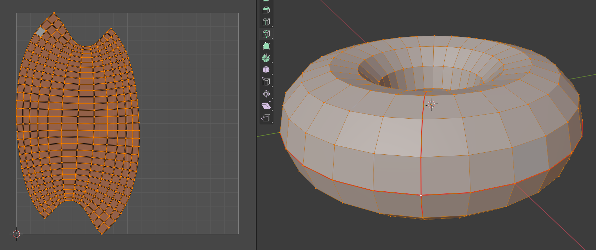

UV maps and UV unwrapping
=========================

First - UV maps and unwrapping are much simpler than it initially seems. Just stick with it for a while and you'll quickly reach a point where it all seems fairly obvious.

A UV map determines how a 2D image is mapped onto a 3D object (and vice-versa - if your 3D object's surface is mapped to a 2D image and you paint directly onto the 3D object then the UV map will determine how that appears on the flat 2D image).

The process of creating a UV map is called UV unwrapping. I.e. it's the process by which the surface of a 3D object is unwrapped to form a flat 2D surface, e.g. think of how the surface of the earth is "unwrapped" to form a flat map. The different rules you can use to do this result in all the different [map projections](https://en.wikipedia.org/wiki/List_of_map_projections).

Andrew uses this example:

  
The original source seems to be this [tweet](https://twitter.com/xxivips/status/938366852039888896?s=20) from @xxivips.

A set of seams need to be specified for your 3D object such that it can be cut open and laid flat (think of the edges of a cereal packet that you'd cut along so that you could lay it out flat). Once laid out flat, the faces of your original 3D object will have corresponding faces in the flat UV map.

You can also think of this process as taking the surface of the object and, making the minimum number of cuts, pealing it off and laying it down flat, i.e _unwrapping_ the object.

The UV map is a mesh - a collection of faces.
If the UV map is laid out over an image then the area of the image covered by a particular face of the map will be mapped to the corresponding face of the 3D object.

If the size of the face in the UV map perfectly matches the size of the face on the 3D object then no distortion will occur. Achieving this correspondence of sizes is easy with shapes like cubes. However, it's much harder with shapes like spheres - you have to decide e.g. if you want a UV map that's easy to work with but requires a lot of distortion in the underlying 2D image or a much more complex UV map which, while reducing the requirement for distortion, increases the complexity of how things are laid out on the 2D image.

E.g. compare the common [Mercator projection](https://en.wikipedia.org/wiki/Mercator_projection), used in maps of the world, with the [Fuller map projection](https://en.wikipedia.org/wiki/Dymaxion_map) and the [Goode homolosine projection](https://en.wikipedia.org/wiki/Goode_homolosine_projection).

If you're not planning on taking an existing image and mapping it onto a 3D object but instead want to paint onto a 3D object and have the result stored as a 2D image texture then things are a lot simpler - you don't really have to worry about the relationship between the size and shape of faces in the UV map and those on the object itself (beyond ensuring that all faces encompass a large enough area in the underlying image to contain the level of detail you want). However, it makes sense to choose the most intuitive mapping possible as this makes it easier to clean up details directly on the 2D image as well as on the 3D object.

**TLDR;** there's a lot on the basics of working with UV maps below but if you're just interested in quickly seeing what the UV maps for the torus shape look like (as it's the core of our donut) then jump to the last sections of this page.

Basics of UV editing
--------------------

First things first, to work with UV maps, you need to switch to the _UV Editing_ workspace. If you've got nothing selected then all you'll see in the _UV Editor_ is what's called the 0-to-1 space:

The name is simple enough - the bottom-left corner has co-ordinates (0, 0) and the top-right corner has co-ordinates (1, 1). You're not forced to keep everything within this space - but not doing so results in confusing result - so when working with UV maps always move and scale the map if necessary to keep it within this space. For a tiny bit more detail see this Blender StackExchange [answer](https://blender.stackexchange.com/a/66732/124535).

If the 0-to-1 space is empty then `tab` to _Object Mode_ and make sure you've got the object you're interested in selected then `tab` to _Edit Mode_ and press `a` to select all its vertices - you should then see the UV map for all the selected faces. If you still don't see anything, make sure you haven't got _Show Overlay_ accidentally toggled off.

Note: If you only select a subset of the vertices then you only see the UV map corresponding to those faces that are fully surrounded by those vertices.

When you add a standard shape, it is created with a UV map where the shape is unwrapped into a reasonable default flat representation. However, this representation doesn't keep sync with changes you make to these objects. So the more you deform or otherwise change the shape, the less appropriate the default unwrapping becomes and you have to re-unwrap it.

_Default cube UV map._  

_Default UV sphere UV map._  

For a more interesting unwrapping example, try the monkey head we used in the very first lesson. Here you can see that the map doesn't need to be a single continuous surface - the head is separated out into multiple areas called islands.

_Default monkey head UV map._  

If you go to _Object Data Properties_ and expand _UV Maps_, you see the default UV map associated with the currently selected object:

**Important:** remember that the left-hand _UV Editor_ only shows the _faces_ that are currently selected in the right-hand _3D Viewport_. So, if you've got nothing selected in the _3D Viewport_ (use `alt-A` to unselect all) then everything disappears in the _UV Editor_. Or try just selecting a single face and you'll just see that face in the _UV Editor_. This confused me initially.

Note: when adding an object, it is possible to disable to automatic generation of a UV map by unticking _Generate UVs_ but I don't see any reason to do this:

### Manual unwrapping

Instead of accepting the default UV map, let's manage the unwrapping of something simple ourselves. Go _File_ / _New_ / _General_ and we'll work on the default cube that's always added for you.

Switch to _UV Editing_ and, in the right-hand _3D Viewport_, switch from the default _Vertex select_ mode to the _Edge select_ mode (the shortcut keys for these two modes are `1` and `2` respectively):

Then think about the edges, you'd cut along with a box cutter if you wanted, for this exercise, to lay it out flat as a t-shape (rather than the default cross shape seen above).

Click with `LMB` and `shift-LMB` to select all the relevant edges and (with x-ray mode turned on so we can see all edges) you should end up with:

There's nothing special about that white edge above - white just indicates the last edge selected.

At the top of the _3D Viewport_, you'll see to the _View_, _Select_ etc. menus - we're interested in the _Edge_ and _UV_ menus. These menus have the shortcuts `ctrl-E` and `u` respectively (remember `e` is already assigned to extrude).

So once you've selected the appropriate edges, press `ctrl-E` and select _Mark Seam_ - those selected edges become highlighted with thicker red lines.

Then press `a` (it'll only unwrap the faces we've selected so, as we want the whole thing unwrapped, select everything), then press `u` and select _Unwrap_.

**Important:** I got quite confused at _many_ points doing this - nothing would appear to happen when I did an unwrap as I'd have selected edges but have forgotten to mark them as seams or I'd have forgotten to select everything, i.e. `a`, before doing the unwrap.

**Update:** if you're in _Object Mode_ then `a` will select all _objects_, it's only when you're in _Edit Mode_ that `a` selects all faces of the object that's currently selected.

Notes:

* Some tutorials suggest deleting the existing UV map, i.e. go to _Object Data Properties_ and press minus for the existing map. This isn't necessary - when you select _Unwrap_, you're completely resetting the map to match the seams and faces that you've currently selected. But it doesn't do any harm to delete the map - when you press _Unwrap_ for the first time after deleting the existing map, it'll automatically create a new map. And perhaps it's less confusing, for some, not to see the existing map when working to produce a new one. You can do more complex unwraps that consist of lots of separate components - in this context deleting the existing map, to completely start from scratch, _may_ be more useful.
* Some tutorials suggest going to the _UV_ menu in either the _UV Editor_ or the _3D Viewport_ and selecting _Reset_. This makes even less sense that deleting the existing map - all it does is reset all the faces so that they lie in a stack on top of each other - try it with the cube - you end up with an oddly greyed out area with four vertices in the _UV Editor_:

It turns out that this is just the six faces of the cube unwrapped into six unconnected faces. If you select the faces separately in the _3D Viewport_ and then select and move them in the _UV Editor_, you'll see you can separate out the faces clearly:

Note: if you just drag vertices in the _UV Editor_ without first selecting an individual face in the _3D Viewport_ then you _sometimes_ end up dragging a vertex associated with more than one face. I'm unsure if such vertices are really shared or if it's multiple vertices sitting on top of each other and I'm selecting all of them at once.

**Update:** I have since discovered situations where _Reset_ did resolve issues. I got myself into situations where unwrapping with _Follow Active Quads_ produced results with unexpected twists in the resulting map and doing _Reset_ and then redoing the unwrap resolved things.

**Update 2:** as noted elsewhere, _Reset_ works because it resolves any issues with the size and shape of the active element. See the documentation for [_Follow Active Quads_](https://docs.blender.org/manual/en/2.92/modeling/meshes/editing/uv.html#follow-active-quads) and in particular the note that says "it is the shape of the active quad in UV space that is being followed, not its shape in 3D space".

### UV checker board grid

Sometimes you want to paint directly onto the object in the _3D Viewport_, in which case the relationship between the size of the faces in the _3D Viewport_ and the size of the faces seen in the _UV Editor_ isn't so important.

However, if you're planing to take an existing image and associate it with the UV map in the _UV Editor_ then if there's a mismatch between the size of the faces there and those seen in the _3D Viewport_, you'll see resulting distortion.

An easy way to check for size mismatches, before using your real image, is to use the predefined _UV Grid_. If you've unwrapped a cube as shown above then, in the _UV Editor_, select _New_, enter e.g. "Checker pattern" for the _Name_ and select _UV Grid_ for the _Generated Type_ and leave the rest unchanged:

Then switch to the _Shading_ workspace, and in the _Shader_ editor (where the nodes are, assuming you've got the cube selected), press `shift-A` and, under _Texture_, select _Image Texture_. In the new node, click the image dropdown (to the left of _New_), select "Checker pattern" and then connect the node's _Color_ output to the input for _Base Color_.

Then switch back to the _UV Editing_ workspace and, in the _3D Viewport_, change the viewport shading to _Material Preview_ (`z` and `2`):

Note: you can have the UV map sticking out beyond the image like this - but the sticking out bit (to the right) is just wrapped round onto the left-hand side of the image which is a bit confusing. So best to move and scale the UV map such that it's completely within the image.

If you look at the faces of the cube, you can see that the checkerboard pattern looks good in all the faces of the cube, i.e. undistorted.

However, if you grab the top face and pull it upwards then the pattern on the sides distorts:

The faces in the UV map are still square and they have to be stretched out to match the faces on the actual object.

This is simple to resolve - in the _3D Viewport_, just select all with `a`, then `u` and select _Unwrap_ again. Now the faces are unwrapped again such that the sizes in the UV map match those of the actual object:

As well as changing the size of faces in the _3D Viewport_, try changing them in the _UV Editor_ and see how things update in the _3D Viewport_.

Once, you've got the checker pattern associated with the object, via an _Image Texture_, you can actually unlink it in the _UV Editor_, if you find it distracting when working with the UV faces (just press the x icon, to the right of the image field, in the menu bar of the _UV Editor_). You can even use a different image in the _UV Editor_ - what matters for the object is the image configured in the _Image Texture_ node.

UV sync selection
-----------------

Sometimes, it can be inconvenient that faces disappear in the _UV Editor_ if they're not selected in the _3D Viewport_. To turn this off and at the same time enable selecting faces in the _UV Editor_ such that you can see them selected in the _3D Viewport_, click _UV Sync Selection_ (the two-way-arrows icon):

Scaling
-------

Sometimes, you can end up with scaling being applied to your object. E.g. if you add a cube, it always starts as 2m3. Then depending on how you manipulate it you may adjust its dimensions directly or you may simply apply a scale to them.

Add a cube and pop out the side menu, then in the _Item_ tab enter 243mm, 83mm and 341mm as the x, y and z dimensions (these are the dimensions of the cereal box seen down below). What this does is apply a scaling to the sides of the 2m3 cube:

In the screenshot above, you can see the dimensions (0.243m etc.) but these are actually achieved by applying a scale value, e.g. 0.122 for _X_ (2m * 0.122 = 0.244m).

If you then mark your desired seams and unwrap the object, you'll see something strange - it uses the unscaled dimensions, i.e. it unwraps the 2m3 cube:

If you look carefully at the status bar above, you'll see that it actually warns you about this issue.

Note: I find it odd that it warns you about this but if you forget to mark any seams (and just assume it'll use the implicit seams that were used for the default UV map) then there's no warning - it just does nothing (leaving you with the unchanged default UV map).

If you notice as odd mismatch between the size of things in the UV map relative to the object then this is probably the issue. To resolve it, `tab` to _Object Mode_ and go to the _Apply_ submenu in the _Object_ menu of the _3D viewport_ (or just press `ctrl-A`) and select _All Transforms_ (or e.g. just _Scale_ if it's the only issue). Then `tab` back to _Edit Mode_, select all vertices with `a` and then `u` and _Unwrap_. You end up with something more like you'd expect:

Mapping an existing image onto a 3D object
------------------------------------------

If you want to see how to take an existing image, like the cereal books, and use it as the image associated with an object and mapped via its UV map then watch this [video](https://youtu.be/GTd8NBg8EZU?t=1496) (the link is set to start at 24m 56s into the video where presenter starts talking about this after having created his UV map).

He uses an open source image editor called [Krita](https://krita.org/en/features/highlights/) but that's irrelevant - you can use Gimp or whatever.

In short - get your UV map laid out in the _UV Editor_, `a` to select the whole map, go to the _UV_ menu, select _Export UV Layout_, adjust the size values to be similar in size to the image you intend to use (like the cereal box image above), some sources say it's best to choose a power-of-two (whether this is really important, I don't know) and save e.g. "cereal-box-uvs.png". Load this into Gimp, Krita or whatever and use it as a template, i.e. turn it into a layer (it's already got alpha set correctly for transparency) and lay out your actual cereal box image below it, then hide the template layer and save the resulting image, e.g. as just "cereal-box.png". Then back in the _UV Editor_, select _Open_ and select the just saved image. Then switch to the _Shading_ workspace, add a new material to the object, if you haven't already done so, add an _Image Texture_ node and select the same image here as well and wire the node to _Base Color_. Then switch back to the _UV Editing_ workspace and in the _3D Viewport_, switch to _Material Preview_ mode.

The result should look like this:

The result is very cool for something so simple.

Aside: I find that video very good but I find the way he cuts up his shapes quite odd - he doesn't seem to think about how he'd cut up an actual box to get the flat shape he wants, instead he seems to pick edges _almost_ at random until he gets things kind of as he wants and then does unnecessary extra work in the _UV Editor_ to get closer to what he wants while still ending up with unnecessary islands (i.e. faces floating free from the others). I could create seams in one go for the simple layout seen above with no separate islands.

Note: in the video, the presenter fills the background of the image with black rather than leaving it transparent. I suspect this may be a good idea if you don't want odd transparent areas on your object where the image doesn't quite line up with your UV map. If you wanted to draw attention to such areas (such that you could correct them) it might be useful to use a far more noticeable color, e.g. bright blue in this case, that contrasts very strongly with the rest of the image.

And finally, a high-quality render:

Torus shapes
------------

As we've been working on a donut, the torus shape is important so let's take a look at it.

### Default UV map

Note: the default map, for any standard shape, is a little unusual in that, unlike the maps you create manually, there are no explicit seams on the 3D object that correspond to the edges of the map.

For the torus, the top and bottom edges of the default map correspond to a circle around the inside of the hole, while the left and right edges correspond to a circle around the "tube" of the torus.

Aside: the default UV map of a torus always seems to include an odd non-orange-tinged face. I asked about that [here](https://blender.stackexchange.com/q/223588/124535) on the Blender StackExchange - it turns out this is the [_Active Element_](https://docs.blender.org/manual/en/2.92/editors/3dview/controls/pivot_point/active_element.html). The best explanation for it, that I've found, is [here](https://victorkarp.wordpress.com/2019/09/30/blender-der-unterschied-zwischen-active-und-selected/) in German (and [here](https://translate.google.com/translate?hl=&sl=de&tl=en&u=https://victorkarp.wordpress.com/2019/09/30/blender-der-unterschied-zwischen-active-und-selected/) translated reasonably well into English by Google Translate). Or this [video](https://www.youtube.com/watch?v=y3ECvX6DdNE&t=279s) (link set to start at 3m 39s where the presenter starts talking about the active element).

**Update:** the active element actually is relevant to unwrapping when using _Follow Active Quads_ (discussed elsewhere). It's this element and its size and shape that determines the outcome of _Follow Active Quads_ unwrapping - when you get onto trying this form of unwrapping, try moving the corners of this element around, relative to each other, and see how it affects things.

### Manually unwrapping a torus

When creating seams for the cube above, it was easy enough to shift-select the individual edges. For a torus, it's more convenient to select _edge loops_. If you hold down `alt` while clicking a single edge with the `LMB` then this "selects a loop of edges that are connected in a line end-to-end, passing through the edge under the mouse pointer" (see the [documentation](https://docs.blender.org/manual/en/latest/modeling/meshes/selecting/loops.html)).

All the unwraps below feature a top to bottom seam around the "tube" of the torus - I won't mention it again, just take it as given.

_Seam around inside of the hole._  

Just like any other object you can take this map and rotate, grab etc. until you've adjusted the map to your requirements, e.g. reshaping the map into the default regular shaped map seen above.

_Seam around outside of the torus._  

_Seam around the top of the torus._  

Aside: I've no idea why the resulting UV maps above don't have at least one axes of symmetry.

The simplest arrangement, I think, is a circular seam around the inside of the hole and then instead of plain _Unwrap_, select one of the other unwrap options - _Follow Active Quads_.

Unlike _Unwrap_, you don't automatically end up with a map that fits within the 0-to-1 space, to resolve this, select the whole map, go to the _UV_ menu, select _Pack Islands_ and then, in the _Pack Islands_ panel that temporarily appears at the bottom of the viewport, untick _Rotate_.

Aside: traditionally, it seems, these little panels, that become available after you perform certain operations, have been called _operator panels_. Even if you've clicked or done something that causes it to disappear, you can get it back via _Adjust Last Operation_ in the _Edit_ menu.

For more on scaling the map to fill the 0-to-1 space, see the cookbook section in the [`LEVEL-2.md`](LEVEL-2.md) on fixing issues with the donut's UV map.

As noted elsewhere, depending on the active element, _Follow Active Quads_ can result in odd shapes, e.g. a map with a twist in it. The easiest way to resolve this is by going to the _UV_ menu, selecting _Reset_ and then redoing things.

Note: look at the various maps above, if you look at those created with plain _Unwrap_, the difference in the dimensions of the faces that make up the map is clear - some are nearly square while others are much more stretched out along one or more sides. If you look at the 3D torus, it's clear that the faces around the outside of the torus are far more square shaped than those along the inside of the hole. If you then use a map, like the one resulting from _Follow Active Quads_, where all the faces are the same size and then combine it with an existing image, it's important to consider the stretching that will result from the discrepancy between the sizes of the faces in the UV map and those on the 3D object. Issues like this can be seen with the massive stretching of the poles that occurs with the most popular world map projections.

**Update:** if you add an image to a UV map then the 0-to-1 space is scaled to the dimensions of the image. So obviously this affects the proportions of the map (relative to the image). E.g. if you had a grid-like UV map where the rectangles of the grid were twice as high as they were wide but then added an image that's twice as wide as it is high then the rectangles of the grid will become proper squares relative to the image.

### End

We're basically done with this diversion, from the main donut series, into looking at UV maps and unwrapping.

In [`LEVEL-2.md`](LEVEL-2.md), I provide a set of mechanical steps for resolving issues with the donut. If you follow these blindly, you should end up with a good UV map and, if you've read this page, you should have enough information to understand those steps or have enough pointers to research them further.

Note: I asked a question on the Blender StackExchange about resolving the UV map issue that I'd experienced. I got an interesting [answer](https://blender.stackexchange.com/a/223516/124535) from Marty Fouts. For the donut situation, I think my cookbook approach is the easiest way to resolve things but Marty's answer covers some interesting things that aren't covered here. In particular, he points out that the _Image Texture_ node has a projection field that defaults to _Flat_ but can be switched to e.g. _Tube_. I experimented with this, both with mapping an existing image onto a torus and when painting directly onto the 3D torus object, but just got myself totally confused as to what _Tube_ projection achieved.

The following are just my original notes taken while watching Andrew's brief discussion of UV unwrapping in part 3 of level 2 of the donut series. They largely just repeat things that are better covered above.

### Original notes

So, looking at things in the _Texture Paint_ workspace, we're interested in how the surface of the purple donut, in the right viewport, is unwrapped into the flat mesh seen in the left viewport.

You can work on UV unwrapping by switching to the _UV Editing_ workspace. When I did this first, the donut just showed up as a grey with no mesh. If this is the case, just `tab` to _Object Mode_, select the donut and then `tab` back to _Edit Mode_.

Once in the _UV Editing_ workspace, with the mesh successfully showing, you can select all the vertices of the donut. Initially, I did this by clicking and dragging to select an area covering the entire donut but I forgot to turn on x-ray - `alt-Z` - and got a very odd layout in the left-hand _UV Editor_:

With x-ray turned on, you get the full mesh:

However, it's worth noting that if you zoom in on the mesh that you'll see the elements of the mesh are taller than they are wide, i.e. they're stretched vertically:

Compare this with the faces on the original donut - some of them are quite square and some of them are much longer along one side than the other. You can use `g`, `s` etc. to grab and move individual nodes or groups of nodes to reshape the mesh as you want - with differing effects on the distortion that would result if you laid down an existing photo on the unwrapped surface.

